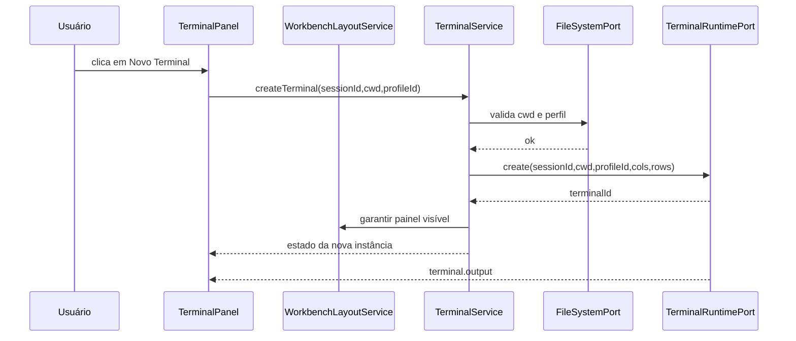
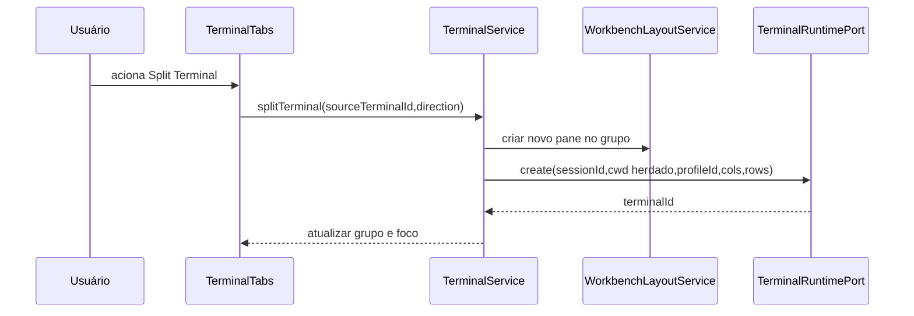
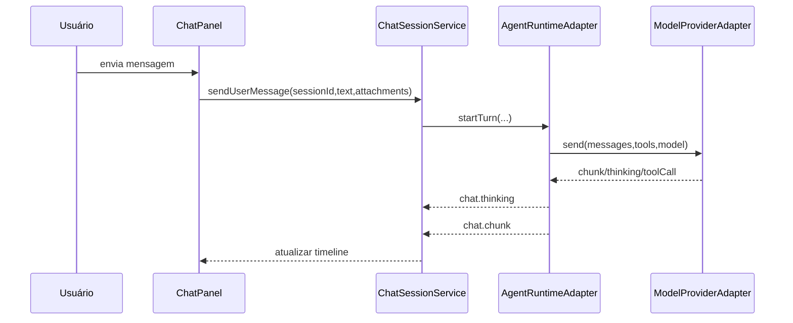
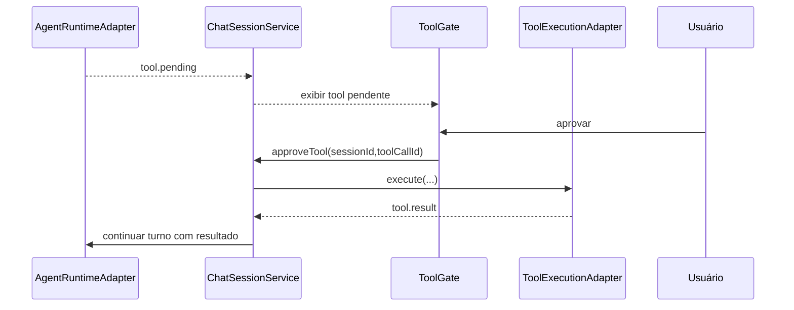
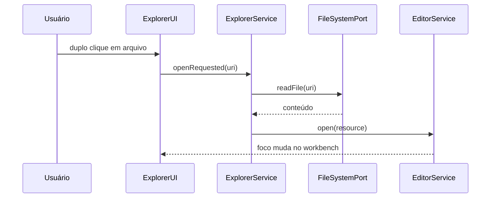
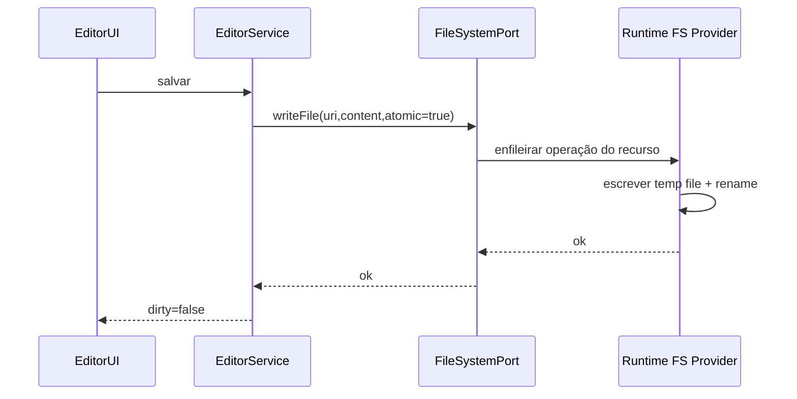
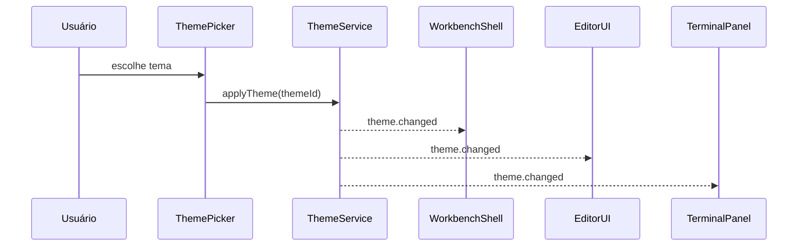

# 03A — FLUXOS ARQUITETURAIS E EXEMPLOS

## Objetivo
Mostrar, com exemplos concretos, como a arquitetura do AGENTE WINDOW deve se comportar na prática. Este documento complementa `03_ARQUITETURA_EXECUTAVEL.md` e reduz ambiguidade na implementação.

## Árvore física alvo da raiz única
A estrutura final desejada converge para uma única raiz de instalação, com separação explícita por papel arquitetural.

```text
agente_window/
  package.json
  src/
    contracts/
      runtime/
      terminal/
      filesystem/
      chat/
      workbench/
      commands/
      theme/
    runtime/
      agent/
      pty/
      filesystem/
      tools/
    logic/
      terminal/
      chat/
      explorer/
      editor/
      workbench/
      commands/
      theme/
    workbench/
      layout/
      parts/
      containers/
    ui/
      terminal/
      chat/
      explorer/
      editor/
      shared/
    shared/
      types/
      events/
      persistence/
      utils/
  tests/
    unit/
    integration/
    e2e/
```

## Regra de posicionamento de código
| Tipo de responsabilidade | Lugar alvo |
|---|---|
| interfaces e tipos públicos | `src/contracts/` |
| bridge de SO, PTY, providers e tools | `src/runtime/` |
| estado, orquestração e regras de negócio | `src/logic/` |
| carcaça do layout e hospedagem visual | `src/workbench/` |
| componentes React e renderização | `src/ui/` |
| tipos compartilhados e helpers puros | `src/shared/` |

## Exemplo 1 — Abrir um terminal


### Tradução implementável
- a UI não cria PTY;
- o serviço de terminal cria a intenção;
- o runtime cria o processo real;
- o workbench apenas garante o espaço visual;
- a saída retorna por evento assíncrono.

## Exemplo 2 — Split do terminal


### Regras críticas
- split nasce na lógica, não na UI;
- o runtime cria uma nova instância, não duplica DOM;
- o foco e o roteamento de input precisam ser atualizados juntos.

## Exemplo 3 — Enviar mensagem no chat


### Regras críticas
- o provider nunca fala com a UI;
- a sessão é o dono do histórico;
- a UI apenas projeta o estado do turno.

## Exemplo 4 — Tool pending com aprovação humana


### Regras críticas
- tool sensível não executa sem gate;
- o gate é do fluxo, não um detalhe cosmético da UI;
- o resultado da tool volta para a mesma sessão e mesmo turno.

## Exemplo 5 — Abrir arquivo pelo Explorer


### Regras críticas
- Explorer não injeta conteúdo direto no editor;
- leitura de arquivo e abertura de aba são passos separados;
- `EditorService` é o dono da abertura de recursos.

## Exemplo 6 — Salvar arquivo com atomicidade


### Regras críticas
- `atomic=true` não é opcional para gravação normal;
- escrita direta por componente é proibida;
- o dirty state só limpa após confirmação de escrita.

## Exemplo 7 — Troca de tema


### Regras críticas
- o tema não exige remontar a aplicação;
- todos os consumidores usam tokens, não cores fixas;
- terminal, editor e workbench precisam responder ao mesmo evento.

## Tabela de ownership por fluxo
| Fluxo | Dono principal | Serviços obrigatórios |
|---|---|---|
| abrir terminal | `TerminalService` | `TerminalRuntimePort`, `WorkbenchLayoutService`, `FileSystemPort` |
| split do terminal | `TerminalService` | `WorkbenchLayoutService`, `TerminalRuntimePort` |
| enviar mensagem | `ChatSessionService` | `AgentRuntimeAdapter` |
| aprovar tool | `ChatSessionService` | `ToolExecutionAdapter`, `AgentRuntimeAdapter` |
| abrir arquivo | `ExplorerService` + `EditorService` | `FileSystemPort` |
| salvar arquivo | `EditorService` | `FileSystemPort` |
| trocar tema | `ThemeService` | consumidores themable |

## Checklist de completude arquitetural
- [x] Há separação explícita entre Runtime, Workbench, Lógica e UI.
- [x] Há fluxos concretos de terminal, chat, explorer, filesystem e tema.
- [x] Há árvore física alvo para a raiz única.
- [x] Há definição de ownership por fluxo.
- [x] Há regras de implementação vinculadas aos fluxos.
