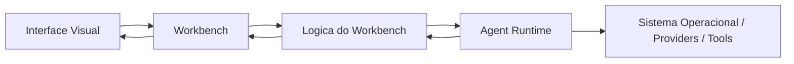

# 03 — ARQUITETURA EXECUTÁVEL

## Objetivo
Traduzir a visão arquitetural do AGENTE WINDOW em um modelo implementável, com fronteiras claras entre camadas, pontos de troca explícitos e regras que impeçam acoplamento estrutural indevido.

## Modelo canônico de 4 camadas

| Camada | Responsabilidade | Exemplos de componentes | Dependências permitidas |
|---|---|---|---|
| 2.1 Motor / Agent Runtime | acesso ao SO, PTY, filesystem, rede, providers de IA e execução de tools | `PtyHost`, `FileHost`, `AgentRuntimeAdapter`, `ToolExecutionAdapter` | nenhuma dependência de UI |
| 2.2 Workbench | carcaça do produto, layout global, partições, docking, focus, persistência geométrica | `WorkbenchShell`, `LayoutManager`, `PartRegistry`, `ViewContainerCoordinator` | pode consumir contratos da Lógica, nunca detalhes de Runtime |
| 2.3 Lógica / Backend do Workbench | regras de negócio, orquestração de sessões, comandos, estados e adaptação entre Workbench e Runtime | `TerminalService`, `ExplorerService`, `ChatSessionService`, `CommandRegistry` | pode falar com contratos do Runtime e notificar o Workbench |
| 2.4 Interface Visual | renderização e interação com o usuário | `TerminalPanel`, `ExplorerTree`, `ChatPanel`, `Titlebar`, `AuxiliaryBar` | só consome estado/comandos da Lógica e do Workbench |

## Regra principal de dependência
A dependência desce nesta ordem:

`Visual -> Workbench -> Lógica -> Runtime`

É proibido:
- UI importar detalhes internos do Runtime;
- Runtime conhecer componentes de UI;
- um subsistema acessar estado interno de outro sem passar por serviço/contrato;
- camadas pularem contratos para “ganhar velocidade”.

## Pilares estruturais

### 1. Workbench separado do motor
A carcaça do workbench não depende do motor específico do agente. Ela precisa funcionar com:
- runtime A ou B;
- provider A ou B;
- conjunto de tools diferente;
- ambiente local ou remoto.

### 2. Provider trocável
A camada de provider não pode vazar para UI.
A UI fala com `ChatSessionService` e `AgentRuntimeAdapter`; a troca de provedor acontece atrás desse contrato.

### 3. Tool layer plugável
Chamadas de ferramenta precisam passar por um contrato único de execução e por um gate de aprovação quando a política exigir confirmação humana.

### 4. Estado centralizado e serializável
Estados de layout, sessões, terminais e chats precisam ser serializáveis para persistência e restauração.

## Fluxo lógico principal

## Módulos funcionais previstos

| Módulo | Camada dominante | Responsabilidade resumida |
|---|---|---|
| Terminal | Runtime + Lógica + Visual | PTY real, múltiplas instâncias, split, foco, persistência e renderização xterm |
| Explorer | Lógica + Visual | árvore, lazy loading, reveal, seleção, ações de arquivo |
| Filesystem I/O | Runtime + Lógica | leitura/escrita atômica, watchers, locks, URIs |
| Chat / Sessões | Lógica + Visual + Runtime | turnos, streaming, confirmação de tools, histórico, artefatos |
| Workbench Layout | Workbench + Visual | barras, painéis, tabs, split view, persistência de layout |
| Command System | Lógica | execução centralizada de comandos, atalhos, menus e contexto |
| Theme / Tokens | Workbench + Visual | tokens CSS, tema reativo e proibição de cores fixas |
| Editor / Browser | Visual + Lógica | abas, grupos, visualizadores, integração com explorer e chat |

## Estado e ownership

| Domínio de estado | Dono | Persistência |
|---|---|---|
| geometria e visibilidade do workbench | `LayoutManager` | `localStorage`/store serializado |
| sessões de chat | `ChatSessionService` | snapshot local e/ou backend |
| instâncias de terminal | `TerminalService` | snapshot leve + reanexação ao runtime quando suportado |
| árvore de arquivos e seleção | `ExplorerService` | cache transitório + seleção persistível |
| tema e preferências visuais | `ThemeService` | persistência local |
| comandos disponíveis e context keys | `CommandRegistry` | recomputado em boot |

## Baseline físico atual vs alvo

| Aspecto | Baseline atual | Alvo arquitetural |
|---|---|---|
| frontend | `AMBIENTE_COMPLETO_PARA_OPENCLAUDE/02_replica_final` | raiz única do projeto |
| backend PTY | `pty-server/` | runtime integrado na mesma raiz |
| documentação | distribuída entre `docs/`, `docs-1/`, `fonte_da_verdade/` | canônica em `docs/` |
| instalação | múltiplos manifests | um `npm install` na raiz |

## Regras de implementação derivadas
1. Toda feature nova nasce primeiro em contrato, não em componente de UI.
2. Toda comunicação cross-subsystem passa por serviço, comando ou evento tipado.
3. Toda persistência tem formato explícito e versionável.
4. Toda referência ao VS Code serve para comportamento; não autoriza copiar acoplamentos incompatíveis com a modularidade alvo.
5. O workbench deve permanecer operacional mesmo quando runtime/provider forem trocados.
