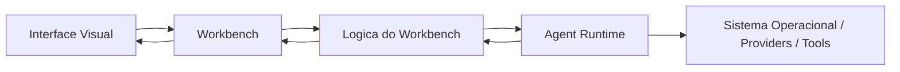

# 03 — ARQUITETURA EXECUTÁVEL

## Objetivo
Traduzir a visão arquitetural do AGENTE WINDOW em um modelo implementável, com fronteiras claras entre camadas, pontos de troca explícitos e regras que impeçam acoplamento estrutural indevido.

## Modelo canônico de 4 camadas

| Camada | Responsabilidade | Exemplos de componentes | Dependências permitidas |
|---|---|---|---|
| 2.1 Motor / Agent Runtime | acesso ao SO, PTY, filesystem, rede, providers de IA e execução de tools | `PtyHost`, `FileHost`, `AgentRuntimeAdapter`, `ToolExecutionAdapter` | nenhuma dependência de UI |
| 2.2 Workbench | carcaça do produto, layout global, partições, docking, focus, persistência geométrica | `WorkbenchShell`, `LayoutManager`, `PartRegistry`, `ViewContainerCoordinator` | pode consumir contratos da Lógica, nunca detalhes de Runtime |
| 2.3 Lógica / Backend do Workbench | regras de negócio, orquestração de sessões, comandos, estados e adaptação entre Workbench e Runtime | `TerminalService`, `ExplorerService`, `ChatSessionService`, `CommandRegistry` | pode falar com contratos do Runtime e notificar o Workbench |
| 2.4 Interface Visual | renderização e interação com o usuário | `TerminalPanel`, `ExplorerTree`, `ChatPanel`, `Titlebar`, `AuxiliaryBar` | só consome estado/comandos da Lógica e do Workbench |

## Regra principal de dependência
A dependência desce nesta ordem:

`Visual -> Workbench -> Lógica -> Runtime`

É proibido:
- UI importar detalhes internos do Runtime;
- Runtime conhecer componentes de UI;
- um subsistema acessar estado interno de outro sem passar por serviço/contrato;
- camadas pularem contratos para “ganhar velocidade”.

## Pilares estruturais

### 1. Workbench separado do motor
A carcaça do workbench não depende do motor específico do agente. Ela precisa funcionar com:
- runtime A ou B;
- provider A ou B;
- conjunto de tools diferente;
- ambiente local ou remoto.

### 2. Provider trocável
A camada de provider não pode vazar para UI.
A UI fala com `ChatSessionService` e `AgentRuntimeAdapter`; a troca de provedor acontece atrás desse contrato.

### 3. Tool layer plugável
Chamadas de ferramenta precisam passar por um contrato único de execução e por um gate de aprovação quando a política exigir confirmação humana.

### 4. Estado centralizado e serializável
Estados de layout, sessões, terminais e chats precisam ser serializáveis para persistência e restauração.

## Fluxo lógico principal


Os exemplos concretos de aplicação desta arquitetura estão em [`03A_FLUXOS_ARQUITETURAIS_E_EXEMPLOS.md`](03A_FLUXOS_ARQUITETURAIS_E_EXEMPLOS.md).

## Módulos funcionais previstos

| Módulo | Camada dominante | Responsabilidade resumida |
|---|---|---|
| Terminal | Runtime + Lógica + Visual | PTY real, múltiplas instâncias, split, foco, persistência e renderização xterm |
| Explorer | Lógica + Visual | árvore, lazy loading, reveal, seleção, ações de arquivo |
| Filesystem I/O | Runtime + Lógica | leitura/escrita atômica, watchers, locks, URIs |
| Chat / Sessões | Lógica + Visual + Runtime | turnos, streaming, confirmação de tools, histórico, artefatos |
| Workbench Layout | Workbench + Visual | barras, painéis, tabs, split view, persistência de layout |
| Command System | Lógica | execução centralizada de comandos, atalhos, menus e contexto |
| Theme / Tokens | Workbench + Visual | tokens CSS, tema reativo e proibição de cores fixas |
| Editor / Browser | Visual + Lógica | abas, grupos, visualizadores, integração com explorer e chat |

## Estado e ownership

| Domínio de estado | Dono | Persistência |
|---|---|---|
| geometria e visibilidade do workbench | `LayoutManager` | `localStorage`/store serializado |
| sessões de chat | `ChatSessionService` | snapshot local e/ou backend |
| instâncias de terminal | `TerminalService` | snapshot leve + reanexação ao runtime quando suportado |
| árvore de arquivos e seleção | `ExplorerService` | cache transitório + seleção persistível |
| tema e preferências visuais | `ThemeService` | persistência local |
| comandos disponíveis e context keys | `CommandRegistry` | recomputado em boot |

## Organização física alvo aprovada

A arquitetura lógica de 4 camadas permanece a mesma, mas sua materialização física aprovada passa a usar um container dedicado `platform/`.

```text
agente_window/
├─ docs/
├─ legacy/
│  └─ AMBIENTE_COMPLETO_PARA_OPENCLAUDE/
│     └─ 02_replica_final/
├─ platform/
│  ├─ apps/
│  │  └─ workbench/
│  │     ├─ src/
│  │     │  ├─ ui/
│  │     │  ├─ workbench/
│  │     │  └─ logic/
│  │     └─ tests/
│  ├─ packages/
│  │  ├─ contracts/
│  │  ├─ shared/
│  │  ├─ agent-runtime/
│  │  ├─ model-provider/
│  │  └─ tools-sdk/
│  ├─ services/
│  │  └─ pty-server/
│  └─ tests/
│     ├─ integration/
│     ├─ e2e/
│     └─ probes/
├─ package.json
├─ package-lock.json
└─ tsconfig.json
```

## Regra de fronteira física
- `platform/apps/` hospeda aplicações compostas e experiência visual final.
- `platform/apps/workbench/src/` concentra a carcaça visual, o shell e a lógica de interação do workbench.
- `platform/packages/` hospeda módulos independentes, reutilizáveis e trocáveis, especialmente contratos, runtime de agente, provider e tools.
- `platform/services/` hospeda serviços operacionais dependentes do ambiente, como PTY e futuros bridges locais.
- `platform/packages/*` não deve depender de `platform/apps/*`.
- `platform/services/*` não deve conhecer componentes visuais.
- `legacy/` não participa da autoridade arquitetural; ele existe apenas como referência transitória até migração explícita.

## Baseline físico atual vs alvo aprovado

| Aspecto | Baseline atual | Alvo arquitetural aprovado |
|---|---|---|
| frontend visual | baseline antiga em `legacy/AMBIENTE_COMPLETO_PARA_OPENCLAUDE/02_replica_final` + nova estrutura em `platform/apps/workbench/` | consolidar a migração funcional para `platform/apps/workbench/` |
| shell/layout/lógica do workbench | `platform/apps/workbench/src/{workbench,ui,logic}` | expandir essa estrutura com implementação funcional progressiva |
| contratos e base compartilhada | `platform/packages/{contracts,shared}` | ampliar o uso desses contratos na migração dos fluxos funcionais |
| runtime de agente / provider / tools | `platform/packages/agent-runtime/` + placeholders em `platform/packages/{model-provider,tools-sdk}` | completar a materialização funcional dos módulos plugáveis |
| backend PTY | `platform/services/pty-server/` | integrar a ponte funcional com a FATIA-03 |
| legado/base antiga | `legacy/AMBIENTE_COMPLETO_PARA_OPENCLAUDE/02_replica_final` | manter como referência transitória até migração explícita |
| documentação | `docs/` | `docs/` |
| instalação | `package.json` raiz único + workspaces já apontando para `legacy/...` e `platform/services/pty-server` | preservar um `npm install` na raiz enquanto a migração funcional avança |

## Regras de implementação derivadas
1. Toda feature nova nasce primeiro em contrato, não em componente de UI.
2. Toda comunicação cross-subsystem passa por serviço, comando ou evento tipado.
3. Toda persistência tem formato explícito e versionável.
4. Toda referência ao VS Code serve para comportamento; não autoriza copiar acoplamentos incompatíveis com a modularidade alvo.
5. O workbench deve permanecer operacional mesmo quando runtime/provider forem trocados.
6. A estrutura física aprovada deve reforçar a separação entre interface, runtime/backend e camada de IA, e não apenas representá-la nominalmente.
