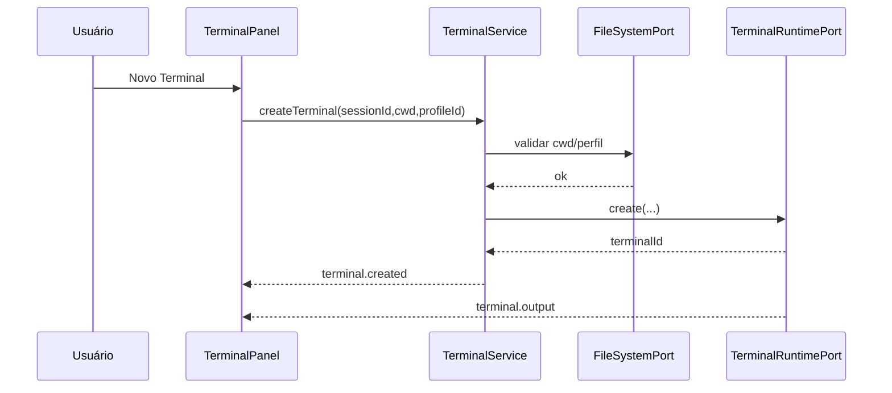

# 01G — Fluxos e Eventos: Terminal

## Fluxo 1 — Criar terminal

## Fluxo 2 — Split e foco
1. Usuário aciona split no terminal ativo.
2. `TerminalService` clona o contexto necessário da instância de origem.
3. `WorkbenchLayoutService` abre novo pane no grupo.
4. `TerminalRuntimePort` cria ou vincula nova instância.
5. O foco muda para a nova instância ou segue a regra definida pela UI.

## Fluxo 3 — Resize / maximize / restore
- mudança geométrica nasce no `WorkbenchLayoutService`;
- UI mede o container ativo;
- Lógica calcula `cols/rows`;
- Runtime recebe `resize`;
- xterm refaz `fit` sem perder buffer.

## Fluxo 4 — Clear
- ação do usuário dispara comando global ou ação local;
- Lógica chama `clear(terminalId)`;
- UI limpa viewport visível;
- sessão e processo continuam ativos.

## Eventos observáveis obrigatórios
| Evento | Condição de emissão | Efeito esperado |
|---|---|---|
| `terminal.output` | chunk recebido do PTY | xterm atualiza viewport |
| `terminal.exit` | processo terminou | UI exibe exit code e preserva aba |
| `terminal.cwd` | shell mudou diretório | estado da sessão atualiza |
| `terminal.focusChanged` | usuário clicou ou navegou por teclado | input passa para a instância focada |

## Integrações críticas
- Terminal -> Filesystem para CWD e validação de executável.
- Terminal -> Workbench para split, maximize/restore e persistência geométrica.
- Terminal -> Sessões para isolamento por `sessionId`.
