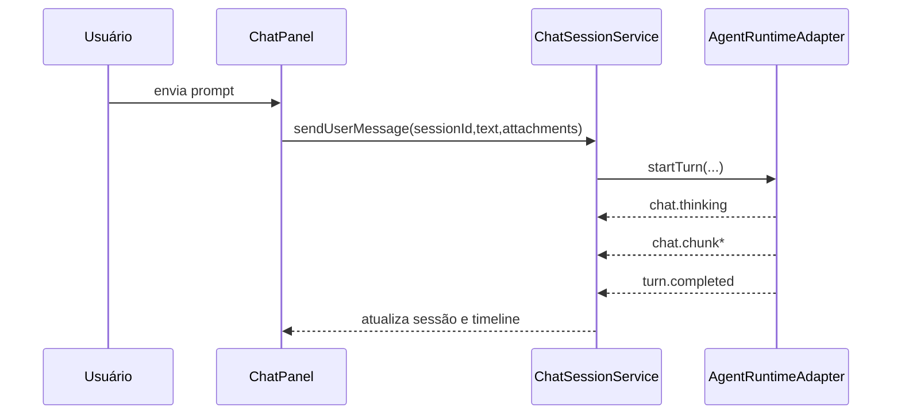

# 04G — Fluxos e Eventos: Center Chat

## Fluxo 1 — Enviar mensagem

## Fluxo 2 — Tool pending
1. Runtime emite `tool.pending`.
2. Lógica marca o turno como aguardando aprovação.
3. UI exibe ações `Permitir` e `Negar`.
4. Usuário decide.
5. Lógica notifica o runtime e o fluxo continua.

## Eventos mínimos
| Evento | Payload mínimo |
|---|---|
| `chat.thinking` | `sessionId`, `turnId`, `label` |
| `chat.chunk` | `sessionId`, `turnId`, `text` |
| `tool.pending` | `sessionId`, `turnId`, `toolCallId`, `toolName` |
| `tool.result` | `toolCallId`, `ok`, `output` |
| `session.activated` | `sessionId` |

## Integrações críticas
- Chat -> Editor para contexto e apply edits.
- Chat -> Terminal e Filesystem via tools.
- Chat -> Sessões para isolamento e unread.
