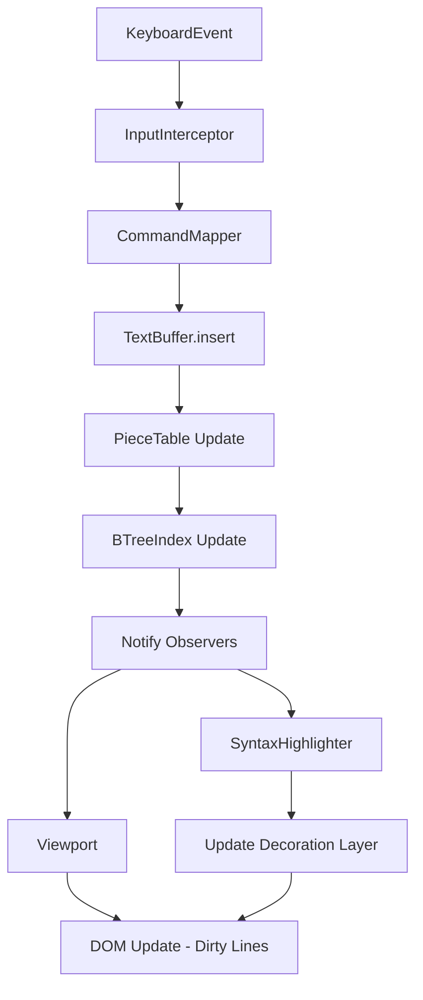

# 05D - Fluxo de Dados do Editor

## 1. Fluxo de Edição (User Input $\rightarrow$ View)
O fluxo de dados para uma simples inserção de caractere é complexo para garantir a integridade do documento.

### Detalhamento do Fluxo:
1. **Captura**: O `InputInterceptor` normaliza a tecla pressionada.
2. **Mapeamento**: O `CommandMapper` decide se é uma operação de texto ou um comando (ex: `Ctrl+Z`).
3. **Mutação**: O `TextBuffer` atualiza a Piece Table. Se for uma deleção, a Piece Table é fragmentada em novas peças.
4. **Indexação**: O `BTreeIndex` recalcula a posição das linhas afetadas.
5. **Notificação**: O padrão Observer dispara eventos para todos os componentes dependentes.
6. **Sintaxe**: O `SyntaxHighlighter` re-analisa apenas as linhas alteradas e as linhas subsequentes (caso a alteração afete o estado do parser, como abrir um comentário multi-linha).
7. **Render**: O `Viewport` identifica as linhas "sujas" e atualiza o DOM via `requestAnimationFrame`.

## 2. Fluxo de Sincronização de Arquivo (FS $\rightarrow$ Editor)
Quando um arquivo é alterado externamente ou aberto:

`FileWatcher` $\rightarrow$ `FSManager` $\rightarrow$ `BufferLoader` $\rightarrow$ `TextBuffer` $\rightarrow$ `Viewport`

- **Carregamento**: O `BufferLoader` lê o arquivo em chunks para evitar travar a UI.
- **Inicialização**: O `TextBuffer` cria a primeira `Piece` apontando para o buffer de leitura.
- **Atualização**: Se o `FileWatcher` detectar mudança, o editor compara o hash do conteúdo. Se houver conflito com edições não salvas, o `ConflictResolver` dispara um alerta de "Arquivo alterado externamente".

## 3. Fluxo de Contexto para IA (Editor $\rightarrow$ Chat)
O editor fornece contexto para o componente de chat via **Range Extraction**:

1. O `ChatComponent` solicita o contexto da linha atual.
2. O `Editor` calcula um range expandido (ex: 50 linhas acima e abaixo do cursor).
3. O `TextBuffer` extrai o texto bruto dessas peças da Piece Table.
4. O texto é enviado ao chat com metadados de linha e coluna para que a IA possa referenciar a posição exata do código.
