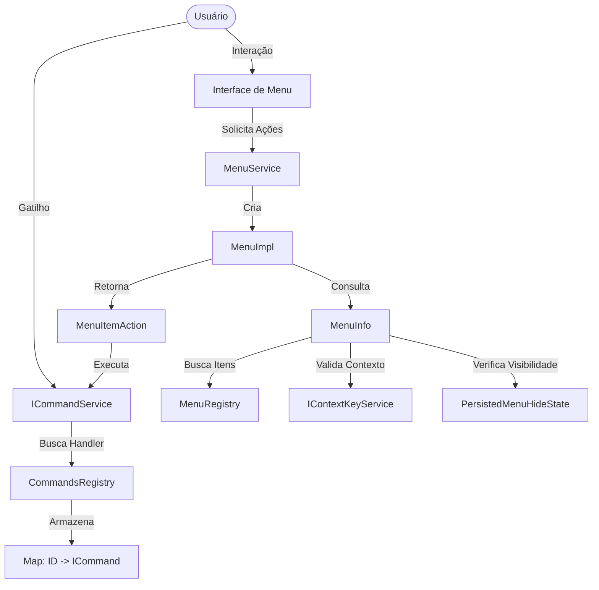

# Mapa de Código do Subsistema de Comandos e Menus (Camada 3)

Este documento mapeia as principais classes e a topologia de dependências do sistema.

## 1. Diagrama de Dependências (Lógica)

## 2. Detalhamento dos Componentes

### Núcleo de Comandos
- **`vscode-main/src/vs/platform/commands/common/commands.ts`**
    - `CommandsRegistry`: Singleton que mantém o mapeamento de IDs para handlers.
    - `ICommandService`: Fachada para execução de comandos.
    - `ICommand`: Interface da definição do comando.

### Núcleo de Menus
- **`vscode-main/src/vs/platform/actions/common/actions.ts`**
    - `MenuRegistry`: Singleton que mantém a lista de itens para cada `MenuId`.
    - `MenuId`: Classe com identificadores estáticos (ex: `EditorContext`, `CommandPalette`).
    - `IMenuItem` / `ISubmenuItem`: Definições de entrada de menu.
- **`vscode-main/src/vs/platform/actions/common/menuService.ts`**
    - `MenuService`: Fábrica de menus.
    - `MenuImpl`: Implementação da interface `IMenu`, gerencia eventos de mudança.
    - `MenuInfo`: Motor de processamento (filtragem, ordenação, recursão de submenus).
    - `PersistedMenuHideState`: Gestor de persistência de visibilidade.

### Integrações
- **`IContextKeyService`**: Fornece a lógica booleana para as cláusulas `when`.
- **`IStorageService`**: Utilizado pelo `PersistedMenuHideState` para salvar preferências no disco.
- **`KeybindingsRegistry`**: Vincula comandos a atalhos de teclado.
