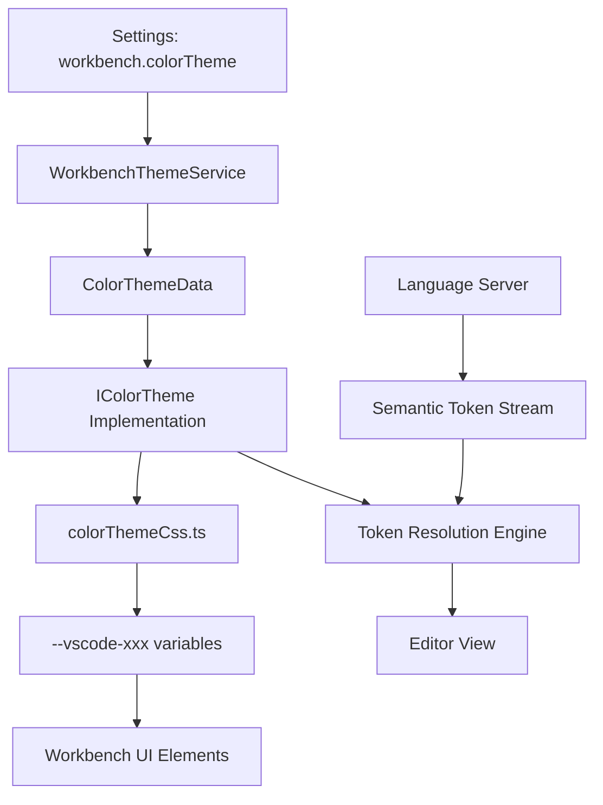

# 08E - Síntese do Modelo: Subsistema de Temas e Tokens

## 1. Definição do Modelo
O subsistema de Temas e Tokens do VS Code é um motor de **estilização reativa baseada em tokens**. Ele separa a *definição de intenção* (ex: "cor do fundo do editor") da *implementação visual* (ex: "#1F1F1F"), utilizando um sistema de resolução em camadas e variáveis CSS para aplicação em tempo real.

## 2. Pilares do Sistema

### A. Abstração de Cores (Color Registry)
O sistema não utiliza cores fixas no código, mas sim `ColorIdentifiers`. Isso permite que qualquer componente seja "tematizável" apenas referenciando um ID.

### B. Hierarquia de Tokens (Token Resolution)
A coloração de código segue a ordem de precedência:
**Semantic Tokens** $\rightarrow$ **User Customizations** $\rightarrow$ **TextMate Scopes** $\rightarrow$ **Base Theme**.

### C. Aplicação via Variáveis CSS
A ponte entre o modelo de dados (TypeScript) e a visualização (HTML/CSS) é feita através de variáveis CSS injetadas dinamicamente, garantindo que a troca de tema não exija a renderização de componentes.

## 3. Diagrama Conceitual de Fluxo

## 4. Conclusão da Engenharia Reversa
O sistema é altamente robusto e extensível. A principal força reside na separação entre o `IThemeService` (plataforma) e o `IWorkbenchThemeService` (aplicação), permitindo que a lógica de cores seja reaproveitada em diferentes contextos (como no modo web ou em extensões). A transição para tokens semânticos representa a evolução do sistema de "estilização por texto" para "estilização por significado".
