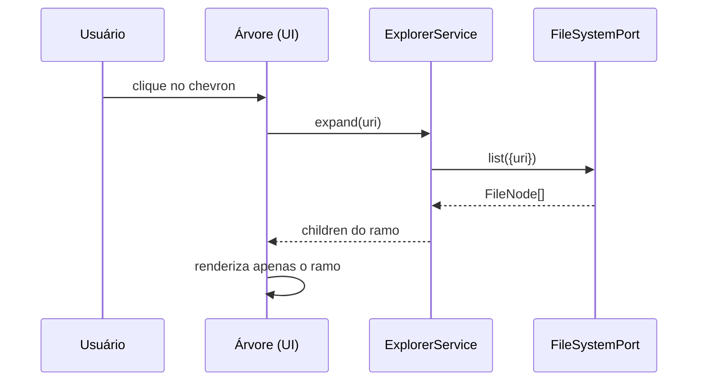

# 04_02 — COMPORTAMENTO DO EXPLORER

> Requisitos do vídeo cobertos: **3.1** (botões, árvore lazy, seleção, foco, reveal, refresh).
> Base contratual atual: `docs/engenharia_reversa/10_EXPLORER_COORDINATOR/*` + `docs/04` §6.

---

## 1. Modelo de responsabilidade (não negociável)

```text
UI (árvore)  →  ExplorerService (lógica)  →  FileSystemPort (runtime)  →  EditorService (abertura)
```

**Evidência da regra** `[E-projeto]` `docs/engenharia_reversa/10_EXPLORER_COORDINATOR/10F`:
> “o Explorer não é dono da leitura/escrita de arquivos; ele coordena navegação” e “abrir recurso deve delegar ao `EditorService`”.

`[E-vscode]` a mesma separação existe: `IExplorerService` (lógica/estado) separado de `IFileService` (I/O) e do `ExplorerView`/`ViewPane` (UI) — `contrib/files/browser/explorerService.ts` vs `views/explorerView.ts:177` (`export class ExplorerView extends ViewPane implements IExplorerView`).

---

## 2. Expandir pasta (lazy)

- **VISUAL:** chevron muda para “aberto”; filhos aparecem abaixo, indentados; item continua selecionado.
- **COMPORTAMENTO:**
  1. primeiro expandir de uma pasta dispara carregamento **somente dos filhos diretos**;
  2. expandir de novo usa cache local (não relê do disco);
  3. pasta vazia mostra linha de “pasta vazia” (sem spinner infinito);
  4. falha de leitura (permissão) mostra mensagem no próprio nó.
- **EVENTO:** `explorer.nodeExpanded { uri }` (ver `10G`), seguido de `explorer.contextChanged` se as ações disponíveis mudarem.
- **Evidência:** `[E-vscode]` `ExplorerDataSource` (`views/explorerViewer.ts:92`) — `IAsyncDataSource<ExplorerItem | ExplorerItem[], ExplorerItem>` → é exatamente o contrato de árvore lazy.
- **VALIDAÇÃO:** `VAL-EXP-01` — expandir chama `FileSystemPort.list` **1×** por pasta; unit test com spy + Playwright E2E.



---

## 3. Colapsar / Colapsar tudo

- **VISUAL:** filhos somem; chevron volta ao estado fechado.
- **COMPORTAMENTO:** “Collapse Folders in Explorer” (header, comando `workbench.files.action.collapseExplorerFolders`) colapsa **todos** os nós de uma vez; a seleção ativa é preservada se o item continuar visível.
- **EVENTO:** `explorer.nodeCollapsed { uri }` / `explorer.allCollapsed {}`.
- **Evidência:** `[E-vscode]` `explorerView.ts:1188-1210` (`collapseExplorerFolders` → `explorerView.collapseAll()`).
- **VALIDAÇÃO:** expandir 5 pastas → colapsar tudo → 0 nós filhos visíveis, scroll volta ao topo, seleção preservada.

---

## 4. Novo arquivo / Nova pasta (inline input)

- **VISUAL:** linha temporária de input **dentro** da árvore, no pai correto, com ícone do tipo a criar; `Enter` confirma, `Esc` cancela; erro de nome (duplicado, caractere inválido) mostra borda vermelha + tooltip.
- **COMPORTAMENTO:**
  1. o pai alvo é o **nó selecionado** (se pasta) ou o **pai do nó selecionado** (se arquivo);
  2. confirmar → cria no disco via `FileSystemPort` (escrita atômica para arquivo vazio) e insere o nó na árvore já em modo **rename automático** (comportamento VS Code: o nome fica selecionado para edição);
  3. colisão de nome → mensagem + input permanece aberto;
  4. nada é criado se a pasta for read-only (precondition do header).
- **EVENTO:** comando `explorer.newFile` / `explorer.newFolder`; resultado em `fs.changed { kind: 'create', uri }` + `explorer.nodeCreated`.
- **Evidência:** `[E-vscode]` `fileActions.ts:65` (`NEW_FILE_COMMAND_ID = 'explorer.newFile'`), `:67` (`NEW_FOLDER_COMMAND_ID = 'explorer.newFolder'`); header registrado em `explorerView.ts:1107+`; `precondition: CanCreateContext` (`explorerView.ts:1101`).
- **VALIDAÇÃO:** `VAL-EXP-04` — criar `a.txt` em pasta expandida: arquivo no disco, nó visível, seleção no novo nó; criar nome duplicado: erro visível e nenhum arquivo novo.

---

## 5. Renomear

- **VISUAL:** label vira input inline com o nome atual selecionado (sem extensão) — padrão VS Code.
- **COMPORTAMENTO:** `Enter` aplica; `Esc` cancela; renomear para nome existente → erro; renomear preserva seleção e expande o nó se era pasta; abas abertas do arquivo renomeado **apontam para o novo caminho**.
- **EVENTO:** `MOVE` no filesystem; `fs.changed { kind: 'rename', from, to }`; `editor.resourceRenamed` (para atualizar abas/breadcrumbs).
- **Evidência:** `[E-vscode]` `fileActions.contribution.ts:637-660` (`RENAME_ID`, label `TRIGGER_RENAME_LABEL`, `precondition: ExplorerResourceWritableContext`, `when: ExplorerRootContext.toNegated()`).
- **VALIDAÇÃO:** renomear arquivo aberto no editor → aba e título atualizam, conteúdo preservado.

---

## 6. Atualizar (Refresh)

- **VISUAL:** ícone `refresh` no header; nenhum flicker na árvore (sem “piscar” a lista).
- **COMPORTAMENTO:** relê o diretório raiz e **reexpande o que estava expandido**, preservando seleção e scroll quando possível; o `IExplorerService.refresh()` é a única porta.
- **EVENTO:** comando `workbench.files.action.refreshFilesExplorer` → `explorer.refreshed`.
- **Evidência:** `[E-vscode]` `explorerView.ts:1142-1165`.
- **VALIDAÇÃO:** `VAL-EXP-03` — criar arquivo via terminal → árvore atualiza sem reload manual; refresh manual com 3 pastas abertas → todas continuam abertas.

---

## 7. Seleção, foco, multi-seleção e reveal

| Comportamento | Regra | Evento |
|---|---|---|
| clique simples | seleciona (não abre) | `explorer.selectionChanged` |
| clique duplo / Enter | abre via `EditorService.open` | `explorer.fileOpened` |
| setas ↑/↓ | navega sem abrir | `explorer.selectionChanged` |
| ←/→ | colapsa/expande | `explorer.nodeExpanded/Collapsed` |
| Ctrl+clique / Shift+clique | multi-seleção (habilita “Colar”, “Excluir” múltiplo, “Baixar” múltiplo) | `explorer.selectionChanged { items[] }` |
| abrir arquivo pelo editor/via comando | Explorer faz **auto-reveal** do nó (expande ancestrais + scroll + foco) | `explorer.revealRequested { uri }` |
| trocar de view container (Explorer→Search→voltar) | seleção e expansão **persistem** | — |

- **Evidência:** `[E-vscode]` `explorerService.ts:240-244` (`findClosest`, `findClosestRoot` = base do reveal), `explorerView.ts:1117/1140` (`ViewTitle` + `workbench.explorer.fileView.focus`).
- **VALIDAÇÃO:** `VAL-EXP-05` — abrir arquivo pelo terminal/API e confirmar auto-reveal com ancestrais expandidos.

---

## 8. Sincronização com o disco (watcher)

- **COMPORTAMENTO:** qualquer mudança externa (outro processo, agente de IA, terminal) reflete na árvore: criação, exclusão, renomeação, alteração de conteúdo (esta última não muda a árvore, mas pode marcar dirty no editor).
- **EVENTO:** `fs.changed { kind: 'create'|'delete'|'rename'|'change', uri }` → consumido pelo `ExplorerService` (e pelo `EditorService` para dirty/close).
- **Evidência:** `[E-projeto]` `docs/04_CONTRATOS_TECNICOS.md`, tabela “Eventos mínimos do sistema” (`fs.changed` = watcher de filesystem → explorer service, editor, dirty state); `docs/engenharia_reversa/06_FILESYSTEM_IO/06B` §4 (UniversalWatcher/Parcel).
- **VALIDAÇÃO:** `VAL-EXP-03` (integração) — escrever via `FileSystemPort` de outro “ator” e ver a árvore atualizar em < 1 s, sem reload.

---

## 9. Estado vazio do Explorer (obrigatório no vídeo)

| Situação | VISUAL | Texto/ação |
|---|---|---|
| workspace sem pasta aberta | ilustração + “You have not opened a folder” | botões “Open Folder” / “Clone Repository” |
| pasta vazia (raiz aberta) | área vazia com dica de DnD | “Arraste arquivos para cá / novo arquivo” |
| busca sem resultados | mensagem de zero resultados | limpar filtro |

- **Evidência:** `[E-vscode]` `views/emptyView.ts`; `[REF-visual]` `explorer/24_explorer_pesquisa_estado_vazio.png`.
- **VALIDAÇÃO:** abrir projeto com raiz vazia → estado vazio; digitar busca inexistente → estado de zero resultados.

---

## 10. Regras de não-regressão aplicáveis

- Nenhuma alteração pode quebrar o terminal blindado (`docs/18` Regras 1–14) — em especial a Regra 10 (`display: contents/none`) que passa a ser **o padrão** também para o anexo do editor (`04_05`).
- O Explorer **não** pode recalcular geometria global do workbench (`09F`: “layout é dono da geometria”).
- Persistência de largura da sidebar e do anexo passa por `WorkbenchLayoutService.serialize()` (`docs/04` §8).
