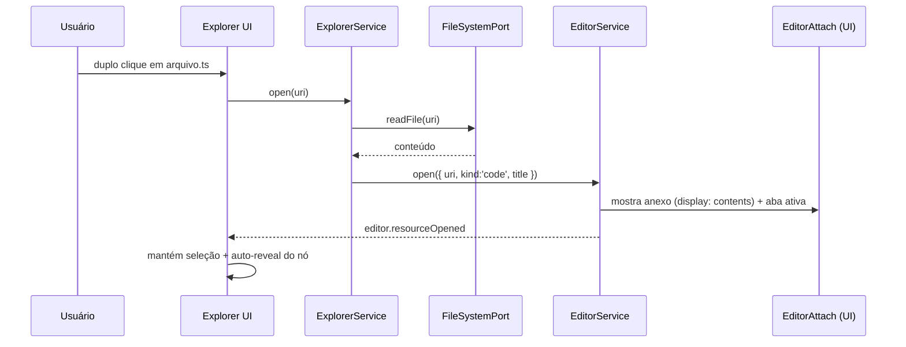
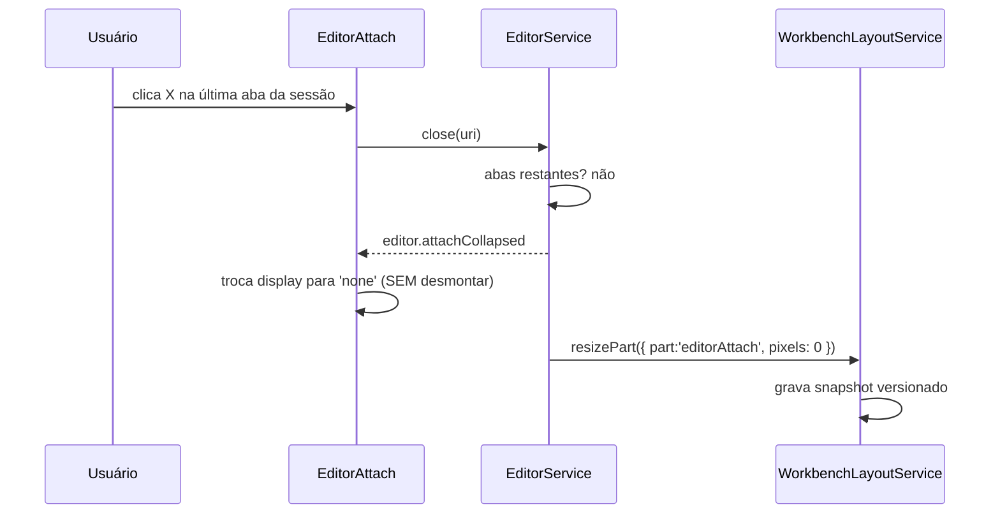

# 04_05 — EDITOR COMO ANEXO LATERAL DA SESSÃO (NÃO OCUPA O CENTRO)

> Requisito do vídeo: **3.2** — “O editor NÃO fica no centro igual VS Code padrão. Ele fica em um **anexo lateral / painel dentro da sessão do Explorer**; pode aumentar/diminuir via sash; quando fecha TODAS as janelas daquela sessão, o anexo **recolhe completamente** (display: contents / none); botão X com comportamento de recolher.”

Este é um **desvio deliberado** em relação ao VS Code (onde o editor é o grupo central). O ADR-010 permite: “o VS Code é referência de **comportamento**, não autorização para copiar acoplamentos”. A decisão de produto abaixo passa a ser canônica para o AGENTE WINDOW.

---

## 1. VISUAL

```text
┌────────────────────────────────────────────── sessão ativa ─────────────────────────────────────────────┐
│  [ Explorer (árvore) .................... ] │ ← sash 6px → │  ┌ Anexo do Editor ─────────────────────┐  │
│  ┌ pasta-a                                 │             │  │ [tabs: a.ts | b.md ×]      [X] [⤢]   │  │
│  │  └ arquivo.ts   ← selecionado           │             │  ├──────────────────────────────────────┤  │
│  └ pasta-b                                 │             │  │ (conteúdo do editor / empty state)   │  │
│                                            │             │  │                                      │  │
│  [seções: Editores Abertos / Timeline / Outline]          │  └──────────────────────────────────────┘  │
└───────────────────────────────────────────────────────────────────────────────────────────────────────┘
        ↑ largura persistida (--session-explorer-width)      ↑ largura do anexo (--editor-attach-width)
```

| Elemento | Regra |
|---|---|
| Posição | à **direita** da árvore do Explorer, **dentro** do contêiner da sessão (`position: relative`) |
| Largura padrão | 46% da largura útil da sessão, clamp **[25%, 75%]** |
| Largura mínima/máxima | 280 px / 1200 px |
| Sash | 6 px, `cursor: col-resize`, `role="separator"`, `aria-orientation="vertical"` |
| Hover do sash | `--vscode-focusBorder` (mesmo padrão do sash do terminal) |
| Cabeçalho | abas + botões `X` (recolher) e `⤢` (maximizar anexo **dentro da sessão**, nunca em `position: fixed`) |
| Estado recolhido | **nenhum** espaço ocupado; árvore ocupa 100% da largura da sessão |
| Empty state | “Selecione um arquivo para abrir no anexo” (centralizado, discreto) |
| Tokens | `--vscode-editor-background`, `--vscode-tab-activeBackground`, `--vscode-tab-inactiveBackground`, `--vscode-editorGroup-border` |

`[REF-visual]` prints `editor/20_editor_yaml_workflow_syntax.png`, `editor/22_editor_markdown_readme_renderizado.png`, `editor/23_editor_estado_vazio_selecione_arquivo.png`, `tabs_breadcrumbs/27_workbench_tabs_breadcrumb_visivel.png` — usados como referência de **conteúdo** do editor; a **posição** (anexo lateral) vem do vídeo, não dos prints.

---

## 2. COMPORTAMENTO

| # | Regra |
|---|---|
| 1 | Abrir arquivo pelo Explorer (duplo clique) **não** usa a área central: o `EditorService` abre a aba **dentro do anexo da sessão** correspondente. |
| 2 | Cada sessão tem **seu próprio conjunto de abas**; trocar de sessão troca as abas exibidas sem destruir as outras (estado por sessão, não global). |
| 3 | O anexo **expande automaticamente** na primeira aba aberta e **recolhe automaticamente** quando a última aba da sessão é fechada. |
| 4 | O usuário pode redimensionar por sash (clamp), e a largura é **persistida por sessão**. |
| 5 | O botão `X` do cabeçalho **não exclui** o arquivo: fecha a aba ativa (ou recolhe o anexo, se for o último). |
| 6 | Recolher **não destrói** o estado: conteúdo, scroll, cursor, dirty state e seleção sobrevivem; ao reabrir, o anexo volta ao ponto anterior. |
| 7 | O editor nunca cobre sidebars/esquerda nem a statusbar — se “maximizar”, expande **só** dentro do contêiner da sessão (`.session-container { position: relative }`), jamais `position: fixed`. |
| 8 | Abrir o mesmo arquivo duas vezes **foca** a aba existente (sem duplicar). |
| 9 | Arquivo alterado externamente + aba suja → aviso de conflito (mesmo comportamento do VS Code). |
| 10 | Salvar (`Ctrl+S` / comando) usa `FileSystemPort.writeFile({ atomic: true })`; o dirty só limpa **após** confirmação da escrita. |

---

## 3. Contrato de recolhimento — regra de ouro (reaproveitada do `docs/18`)

`[E-projeto]` `docs/18` **Regra 10** já blinda exatamente este padrão para o terminal:

```tsx
return (
  <div style={{ display: visible ? 'contents' : 'none' }}>
    <VSCodeTerminal visible={visible} ... />
  </div>
);
```

`[SPEC]` O anexo do editor **deve usar o mesmo contrato**:

```tsx
// EditorAttachPanel.tsx  (proposta — não implementar nesta fase)
return (
  <div style={{ display: hasTabs || userPinnedOpen ? 'contents' : 'none' }} data-editor-attach>
    <EditorAttach surface={surface} sessionId={sessionId} />
  </div>
);
```

**Motivo (idêntico ao do terminal):** desmontar o componente descarta o modelo de texto, o scroll, o undo-stack e os listeners de watcher. Com `display: none`, tudo permanece vivo e a reabertura é instantânea.

**Proibido:** `if (!visible) return null` no anexo do editor. **Obrigatório:** primeiro mount acontece uma única vez por sessão (padrão `useState(visible)` + `mounted` como em `PlatformTerminalBridge.tsx` `[E-projeto]`).

---

## 4. Interação com o Workbench Layout (não violar `09F`)

- A **geometria da sessão** pertence ao `WorkbenchLayoutService`; o anexo apenas **pede** uma faixa e reporta intenção (`resizePart`).
- Proibido o componente do anexo recalcular a grade global (`09F`: “componente de módulo alterar geometria global diretamente” é proibido).
- A largura do anexo entra no snapshot versionado:

```ts
interface WorkbenchLayoutSnapshot {
  version: 1;
  visibleParts: { leftSidebar: boolean; rightSidebar: boolean; panel: boolean; auxiliaryBar: boolean; statusBar: boolean };
  dimensions: Record<string, number>;   // ex.: { sessionExplorer: 320, editorAttach: 640, terminal: 300 }
  activeViews: Record<string, ViewId>;  // ex.: { sessionExplorer: 'explorer', editorAttach: 'editor' }
}
```

---

## 5. EVENTOS

| Evento | Payload | Efeito |
|---|---|---|
| `editor.attachOpened { sessionId }` | sessão | anexo passa a `display: contents` |
| `editor.attachCollapsed { sessionId }` | sessão | anexo passa a `display: none` (estado preservado) |
| `editor.resourceOpened { sessionId, uri, kind }` | recurso | aba criada/focada; `explorer.selectionChanged` sincroniza |
| `editor.resourceClosed { sessionId, uri }` | recurso | aba removida; se última → `editor.attachCollapsed` |
| `editor.attachResized { sessionId, pixels }` | largura | layout persiste dimensão |
| `editor.dirtyChanged { uri, dirty }` | — | aba mostra ponto de “não salvo” |
| `editor.revealRequested { uri, line, column }` | — | conteúdo rola até linha/coluna |

---

## 6. FLUXO — abrir arquivo pelo Explorer (mermaid)



## 7. FLUXO — fechar a última aba (mermaid)



---

## 8. VALIDAÇÃO

**Focados (unit):**
- [ ] abrir 2 arquivos cria 2 abas na mesma sessão e foca a última;
- [ ] abrir o mesmo arquivo 2× resulta em 1 aba;
- [ ] fechar a última aba emite `editor.attachCollapsed` e **não** desmonta o componente (spy no unmount = 0 chamadas);
- [ ] reabrir após collapse preserva scroll/cursor/undo (comparar estado serializado).

**Integração:**
- [ ] `ExplorerService.open` delega ao `EditorService` (nunca injeta conteúdo na UI);
- [ ] `writeFile(atomic)` e dirty state coerentes após salvar;
- [ ] `fs.changed` externo com arquivo aberto → aba revalida.

**E2E (navegador real):**
- [ ] `VAL-EXP-11`: abrir arquivo → anexo aparece à direita, árvore continua visível à esquerda;
- [ ] `VAL-EXP-12`: arrastar sash → largura muda suavemente, sem travar; recarregar página → largura persistida;
- [ ] `VAL-EXP-13`: fechar todas as abas → anexo recolhe 100%; reabrir arquivo → conteúdo intacto (sem “branco”);
- [ ] `VAL-EXP-14`: com o anexo maximizado, **Activity Bar (48 px), sidebar esquerda e statusbar continuam visíveis** (mesma checagem da Regra 6 do `docs/18` para o terminal).

---

## 9. Não-regressão (obrigatório)

- Não usar `position: fixed` no anexo (viola Regra 6 do `docs/18` por analogia e `09F` por contrato).
- Não alterar `.right-section`, `app.css` nem `App.tsx` sem decisão explícita — são **PROTEGIDOS** (`docs/18` §2, nível 🟡).
- O padrão `display: contents/none` do `PlatformTerminalBridge.tsx` **não** deve ser copiado por importação (o arquivo é BLINDADO 🔴); o anexo implementa o **mesmo contrato**, com código próprio.
