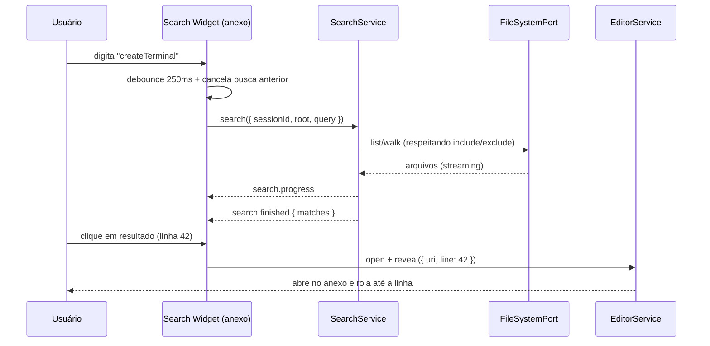

# 04_06 — PESQUISA DENTRO DA SESSÃO DO EDITOR (SEARCH LOCAL)

> Requisito do vídeo: **3.3** — “Pesquisa (Search) que fica **DENTRO da sessão do editor**, não global.”

---

## 1. Referência real no VS Code (o que reaproveitar)

| Comportamento | Evidência |
|---|---|
| View de pesquisa como *view container* da sidebar (`workbench.view.search`) | `[E-vscode]` `src/vs/workbench/contrib/search/browser/search.contribution.ts`, `searchView.ts` |
| Inputs: padrão de busca, substituição, `files to include`, `files to exclude` | `[E-vscode]` `search/browser/searchWidget.ts`, `patternInputWidget.ts` |
| Toggles: Case Sensitive, Whole Word, RegExp | `[E-vscode]` `search/common/search.js` + `searchWidget.ts` |
| Árvore de resultados agrupada por arquivo, com contagem | `[E-vscode]` `search/browser/searchView.ts` (renderer da árvore) |
| Substituir tudo / substituir por arquivo | `[E-vscode]` `replace.ts`, `replaceService.ts` |
| Estado vazio | `[E-vscode]` `searchView.ts` + `[REF-visual]` `explorer/24_explorer_pesquisa_estado_vazio.png` |

> **O que o VS Code NÃO tem:** escopo de busca limitado a uma “sessão”. No AGENTE WINDOW, o Search é **contextual à sessão do editor** (raiz da sessão), não ao workspace inteiro.

---

## 2. VISUAL

```text
┌ Anexo do Editor — aba "Pesquisar" ─────────────────────────────┐
│  🔍 [ buscar…                 ]  Aa  ab  .*   [⇄ substituir]   │
│  [incluir: *.ts, src/**]           [excluir: node_modules]      │
│  ──────────────────────────────────────────────────────────────│
│  ▸ src/services/api.ts (4)                                      │
│      linha 12  · fetch(ur…   [contexto]        [substituir]     │
│      linha 48  · …                                              │
│  ▸ src/ui/Panel.tsx (2)                                         │
│  ──────────────────────────────────────────────────────────────│
│  6 resultados em 2 arquivos                                     │
└─────────────────────────────────────────────────────────────────┘
```

| Elemento | Regra |
|---|---|
| Onde vive | **dentro do anexo lateral** (`04_05`), como uma aba de recurso do tipo `search` — não na sidebar primária |
| Toggle de substituição | botão `⇄` expande a segunda linha de input |
| Toggles de opção | 3 botões 22×22 com estado ativo destacado (`--vscode-inputOption-activeBackground`) |
| Resultados | árvore com arquivo → linhas; clique na linha abre o arquivo **no mesmo anexo** e faz `reveal` na linha |
| Contagem | “N resultados em M arquivos” com plural correto (i18n) |
| Estado vazio | `Nenhum resultado encontrado.` (+ dica de revisar excluídos) |
| Estado inicial | `Digite para pesquisar no escopo da sessão` |
| Tokens | `--vscode-input-background`, `--vscode-input-border`, `--vscode-inputOption-activeBorder`, `--vscode-list-activeSelectionBackground` |

`[REF-visual]` `explorer/24_explorer_pesquisa_estado_vazio.png` (estado vazio) e `editor/23_editor_estado_vazio_selecione_arquivo.png` (linguagem de empty state).

---

## 3. COMPORTAMENTO

| # | Regra |
|---|---|
| 1 | Escopo da busca = **raiz da sessão** (o que o Explorer daquela sessão mostra) + filtros de incluir/excluir. |
| 2 | Busca é **assíncrona e cancelável**: digitar mais caracteres cancela a busca anterior (última vence). |
| 3 | Debounce de 250 ms antes de disparar a busca (evitar varrer a árvore a cada tecla). |
| 4 | Limite padrão: 20 000 resultados / arquivo > 1 MB com aviso (“arquivo muito grande para buscar”). |
| 5 | Ignorar `node_modules`, `.git`, `dist`, `build`, `out`, `.next` por padrão (mesma lista do `compactar_projeto.py` `[E-projeto]`). |
| 6 | Clique em resultado abre no **anexo** e faz `reveal` na linha/coluna (sincroniza com `editor.revealRequested`). |
| 7 | “Substituir tudo” passa por `FileSystemPort.writeFile({ atomic: true })` e reporta contagem alterada; falha em 1 arquivo não impede os outros e é listada ao final. |
| 8 | A busca **não** mantém arquivo em memória após trocar de aba (resultados são descartáveis). |
| 9 | A sessão guarda o **último termo** pesquisado (restaurado ao reabrir a aba), nunca o resultado completo. |

---

## 4. EVENTOS

| Evento | Payload | Consumidor |
|---|---|---|
| `search.started` | `{ sessionId, pattern, options }` | UI (spinner/estado) |
| `search.progress` | `{ filesSearched, matchesSoFar }` | contador incremental |
| `search.finished` | `{ sessionId, fileCount, matchCount, truncated }` | árvore de resultados |
| `search.cancelled` | `{ sessionId }` | limpa estado pendente |
| `search.replaceApplied` | `{ files, replacements }` | notificação + dirty state |
| `editor.revealRequested` | `{ uri, line, column }` | editor abre/rola até a linha |

---

## 5. Contrato proposto (resumo — completo em `04_10` §4)

```ts
export interface SearchQuery {
  pattern: string;
  isRegExp?: boolean;
  isCaseSensitive?: boolean;
  isWholeWord?: boolean;
  include?: string;   // ex.: 'src/**,*.ts'
  exclude?: string;   // ex.: 'node_modules/**'
}

export interface SearchMatch { uri: WorkspaceUri; line: number; column: number; preview: string; }
export interface SearchResult { matches: SearchMatch[]; fileCount: number; matchCount: number; truncated: boolean; }

export interface SearchService {
  search(input: { sessionId: SessionId; root: WorkspaceUri; query: SearchQuery; token?: CancellationToken }): Promise<SearchResult>;
  replaceAll(input: { sessionId: SessionId; root: WorkspaceUri; query: SearchQuery; replacement: string }): Promise<{ files: number; replacements: number }>;
}
```

`[E-projeto]` já existe `legacy/.../src/domain/search.ts` (2,0 KB) e o contrato `ViewId` inclui `'search'` (`platform/packages/contracts/common.ts`) — a FASE 4 promove isso a serviço com escopo de sessão.

---

## 6. FLUXO (mermaid)



---

## 7. VALIDAÇÃO

**Focados:** debounce cancela busca anterior; respeita include/exclude; ignora `node_modules`; plural correto em i18n; `truncated` quando passa do limite.

**Integração:** “substituir tudo” grava atomicamente e atualiza dirty; arquivo aberto com alterações reflete no editor.

**E2E (`VAL-EXP-15`):** buscar termo existente → resultados agrupados; clicar → abre no anexo na linha correta; buscar inexistente → estado vazio correto; substituir 3 ocorrências → conteúdo no disco atualizado.

**Não-regressão:** a busca é **nova** — não pode tocar `VSCodeTerminal.tsx` nem o painel inferior (as 5 abas Problemas/Saída/Debug/Terminal/Portas continuam intactas; ver `docs/18` Regra 5).
