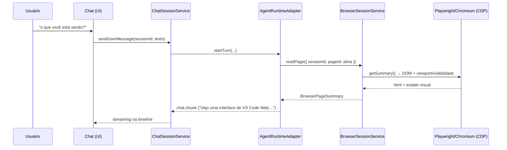
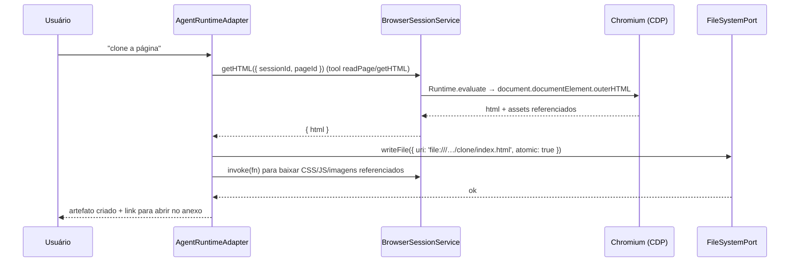
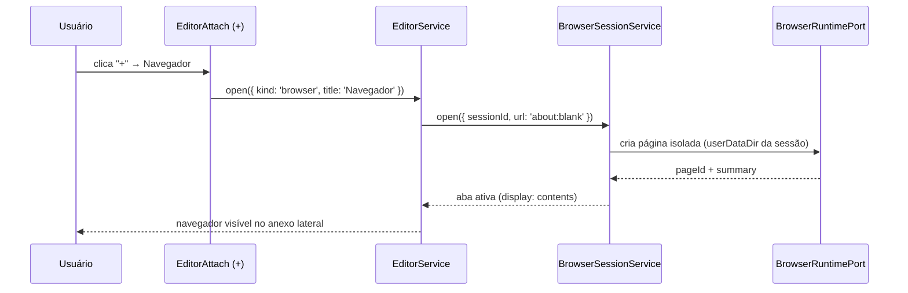

# 04_07 — BROWSER DA SESSÃO DO EDITOR + ACESSO DA IA AO HTML (REQUISITO CRÍTICO)

> Requisitos do vídeo: **3.3** (“botão + abre um NAVEGADOR dentro da sessão do editor; funciona de verdade, renderiza página web”) e **3.4** (“a IA deve ter acesso ao conteúdo da página aberta: analisar HTML, analisar conteúdo, clonar página, interagir — filmar, clicar; referência: IA integrada no Chrome que responde *‘Você está vendo uma interface do Visual Studio Code Web aberta no navegador’* quando perguntada *‘o que você está vendo?’*”).
>
> **Este é o documento mais importante desta FASE 4.**
>
> Evidências visuais canônicas do vídeo oficial (ver [`prints/CATALOGO_PRINTS_FATIA_04.md`](file:///c:/Users/Usuario/Desktop/agente_window/a/agente_window/docs/engenharia_reversa/FATIA-04_VIDEO_COMPLETO/prints/CATALOGO_PRINTS_FATIA_04.md)):
> - [`prints/06_navegador_anexo_empty_state_autocomplete.png`](file:///c:/Users/Usuario/Desktop/agente_window/a/agente_window/docs/engenharia_reversa/FATIA-04_VIDEO_COMPLETO/prints/06_navegador_anexo_empty_state_autocomplete.png) — Aba *Navegador*, barra de URL com autocomplete e empty state de suporte ao chat (05:01).
> - [`prints/07_navegador_anexo_google_renderizado.png`](file:///c:/Users/Usuario/Desktop/agente_window/a/agente_window/docs/engenharia_reversa/FATIA-04_VIDEO_COMPLETO/prints/07_navegador_anexo_google_renderizado.png) — Página real renderizada (`https://www.google.com/`) no anexo lateral da sessão ao lado do Chat (05:05).
> - [`prints/08_ia_percepcao_html_gemini_vscode_web.png`](file:///c:/Users/Usuario/Desktop/agente_window/a/agente_window/docs/engenharia_reversa/FATIA-04_VIDEO_COMPLETO/prints/08_ia_percepcao_html_gemini_vscode_web.png) — **Comprovante cabal da percepção da IA:** Gemini analisando e descrevendo o HTML da página web aberta no navegador em resposta à pergunta *"o que vc esta vendo"* (05:40).

---

## 1. O que o VS Code real faz (evidência dura)

### 1.1 VS Code **desktop** (Electron) — browser integrado com CDP + Playwright + tools de IA
`[E-vscode]` `src/vs/workbench/contrib/browserView/`:

| Componente | Arquivo | Papel |
|---|---|---|
| Serviço CDP | `electron-browser/browserViewCDPService.ts` | Ponte **Chrome DevTools Protocol** para as páginas do browser integrado |
| Serviço Playwright | `platform/browserView/common/playwrightService.ts` | API `IPlaywrightService`: instância Playwright **por sessão** |
| Páginas | `common/browserView.ts` (`IBrowserViewWorkbenchService`) | gerencia abas/páginas do browser interno |
| Nomes de tools | `platform/browserView/common/browserChatToolReferenceNames.ts` | **lista canônica** abaixo |
| Tools de IA | `electron-browser/tools/*Tool.ts` | implementação de cada tool |
| Contribuição das tools | `electron-browser/tools/browserTools.contribution.ts` | cria o **ToolSet “browser”** e registra no serviço de tools do chat |
| Features | `electron-browser/features/browserDevToolsFeature.ts`, `browserEditorChatFeatures.ts`, `browserSearchFeatures.ts`, `browserHistoryFeature.ts`, `browserPermissionsFeature.ts`, `browserRemoteFeatures.ts`, `browserDataStorageFeatures.ts`, `overlayManager.ts`, `widgets/browserUrlBarWidget.ts` | DevTools, chat contextual, find, histórico, permissões, storage, barra de URL |

### 1.2 Lista canônica das tools de browser para IA `[E-vscode]`
`platform/browserView/common/browserChatToolReferenceNames.ts` (arquivo inteiro):

```ts
export const BrowserChatToolReferenceName = {
  OpenBrowserPage: 'openBrowserPage',
  ReadPage: 'readPage',
  ScreenshotPage: 'screenshotPage',
  NavigatePage: 'navigatePage',
  ClickElement: 'clickElement',
  TypeInPage: 'typeInPage',
  HoverElement: 'hoverElement',
  DragElement: 'dragElement',
  HandleDialog: 'handleDialog',
  RunPlaywrightCode: 'runPlaywrightCode',
} as const;
```

Comentário do próprio arquivo (citado literalmente): *“Lives in `platform` … so the Copilot agent host — which cannot import from `workbench` — can gate its browser tool instructions on the same names.”* → **a camada de agente consome esses nomes por contrato**, exatamente a separação que o `docs/03` do AGENTE WINDOW exige (Lógica/Runtime atrás de contrato, UI nunca decide).

Display names reais (`[E-vscode]` `tools/*Tool.ts`): *Open Browser Page, Read Page, Screenshot Page, Navigate Page, Click Element, Type in Page, Hover Element, Drag Element, Handle Dialog, Run Playwright Code, List Browser Pages*.

### 1.3 Como a IA “vê” a página — API real `[E-vscode]` `platform/browserView/common/playwrightService.ts`

```ts
export interface IPlaywrightService {
  /** Espera a nova página e devolve o resumo inicial. */
  waitForPageAndGetSummary(sessionId: string, pageId: string, expectedUrl: string, discoveryTimeoutMs: number): Promise<string>;

  /** Resumo do estado atual da página: inclui o DOM e a representação visual. */
  getSummary(sessionId: string, pageId: string): Promise<string>;

  /** Executa função arbitrária recebendo o objeto `page` do Playwright. */
  invokeFunctionRaw<T>(sessionId: string, pageId: string, fnDef: string, ...args: unknown[]): Promise<T>;

  /** Executa função e devolve resultado de tool, com erro tratado, timeout e resultado diferido. */
  invokeFunction(...): Promise<IInvokeFunctionResult>;   // (assinatura conforme arquivo)

  /** Continua aguardando resultado diferido (operação longa não morre no timeout). */
  waitForDeferredResult(sessionId: string, deferredResultId: string, ...): Promise<IInvokeResult>;
}
```

Pontos extraídos literalmente do arquivo:
- *“The service maintains a separate Playwright browser instance **per session**. Callers must pass a `sessionId` to every method so operations are routed to the correct instance.”* → **isolamento por sessão** (mesma semântica da nossa “sessão do editor”).
- *“Main-process audience selectors determine which pages each session can interact with.”* → **controle de visibilidade/escopo por sessão**.
- `getSummary` devolve **DOM + representação visual** — é isto que permite a resposta *“o que você está vendo?”*.
- Timeout + `deferredResultId` → operações longas (ex.: gravação/clique que demora) não são abortadas silenciosamente.

### 1.4 VS Code **web** (navegador) — limite conhecido
`[E-vscode]` `extensions/simple-browser/src/simpleBrowserView.ts`:
- o “Simple Browser” web é um **`WebviewPanel`** com `<iframe sandbox="allow-scripts allow-forms allow-same-origin allow-downloads">` (linha 169);
- possui CSP própria (linha 130) e um overlay de “Focus Lock” (linha 168);
- **não expõe DOM nem CDP**: por segurança de origem, a IA **não consegue** ler o HTML de páginas de terceiros por dentro do iframe.

**Conclusão técnica (inegociável):** no produto **web** do AGENTE WINDOW, para atender ao requisito 3.4 **não basta** um iframe. É preciso um navegador **controlável do lado do servidor** (Chromium headless com Playwright/CDP) — que é exatamente a arquitetura que o VS Code **desktop** usa (`IPlaywrightService` + `browserViewCDPService`).

---

## 2. Arquitetura proposta para o AGENTE WINDOW (web)

```text
┌──────────── Sessão (UI, anexo do editor) ────────────┐
│ aba "Navegador"  ← renderiza o stream/VDOM da página │
└───────────────▲──────────────────────────────────────┘
                │ BrowserPort (contrato, tipado, sem DOM, sem iframe cru)
┌───────────────┴──────────────────────────────────────┐
│ Logic: BrowserSessionService (por sessionId)          │
│  • abrir/fechar/navegar/voltar                        │
│  • getSummary()  → DOM textual + metadados visuais    │
│  • getHTML()     → HTML serializado da página         │
│  • invoke(fn, args) → executa no contexto da página   │
│  • clique/type/hover/drag/dialog                      │
│  • screenshot() / record()                            │
└───────────────▲──────────────────────────────────────┘
                │ Runtime: BrowserRuntimePort
┌───────────────┴──────────────────────────────────────┐
│ services/browser-runtime (Node)                       │
│  Playwright → Chromium headless (CDP habilitado)      │
│  uma instância isolada por sessão (userDataDir próprio)│
└──────────────────────────────────────────────────────┘
```

**Decisão:** o browser interno **é do servidor**; o navegador do usuário só exibe a página (via CDP screencast `Page.startScreencast` **ou** proxy same-origin). Assim a IA e o usuário veem **a mesma** página, e o HTML é acessível de verdade.

---

## 3. Contrato proposto (completo em `04_10` §5)

```ts
export type BrowserPageId = string;

export interface BrowserPageSummary {
  url: string;
  title: string;
  /** DOM legível (texto + estrutura) para o modelo. */
  domSummary: string;
  /** Descrição visual (viewport, elementos visíveis, scroll, foco). */
  visualSummary: string;
  viewport: { width: number; height: number };
}

export interface BrowserPort {
  open(input: { sessionId: SessionId; url: string; newTab?: boolean }): Promise<{ pageId: BrowserPageId; summary: BrowserPageSummary }>;
  list(input: { sessionId: SessionId }): Promise<Array<{ pageId: BrowserPageId; url: string; title: string; active: boolean }>>;
  activate(input: { sessionId: SessionId; pageId: BrowserPageId }): Promise<void>;
  close(input: { sessionId: SessionId; pageId: BrowserPageId }): Promise<void>;

  navigate(input: { sessionId: SessionId; pageId: BrowserPageId; url: string }): Promise<BrowserPageSummary>;
  goBack(input: { sessionId: SessionId; pageId: BrowserPageId }): Promise<void>;

  getSummary(input: { sessionId: SessionId; pageId: BrowserPageId }): Promise<BrowserPageSummary>;   // ⇐ "o que você está vendo?"
  getHTML(input:    { sessionId: SessionId; pageId: BrowserPageId; selector?: string }): Promise<{ html: string; bytes: number }>; // ⇐ "clone a página"
  screenshot(input: { sessionId: SessionId; pageId: BrowserPageId; fullPage?: boolean }): Promise<{ mime: 'image/png'; dataBase64: string }>;

  click(input:   { sessionId: SessionId; pageId: BrowserPageId; target: ElementTarget }): Promise<void>;
  type(input:    { sessionId: SessionId; pageId: BrowserPageId; target: ElementTarget; text: string; submit?: boolean }): Promise<void>;
  hover(input:   { sessionId: SessionId; pageId: BrowserPageId; target: ElementTarget }): Promise<void>;
  drag(input:    { sessionId: SessionId; pageId: BrowserPageId; from: ElementTarget; to: ElementTarget }): Promise<void>;
  handleDialog(input: { sessionId: SessionId; pageId: BrowserPageId; action: 'accept' | 'dismiss'; promptText?: string }): Promise<void>;

  invoke<T>(input: { sessionId: SessionId; pageId: BrowserPageId; fnDef: string; args?: unknown[]; timeoutMs?: number }): Promise<T>;

  /** Gravação de sessão do browser (requisito "filmar" do vídeo). */
  record(input: { sessionId: SessionId; pageId: BrowserPageId; action: 'start' | 'stop' }): Promise<{ videoUri?: WorkspaceUri }>;

  onEvent(listener: (e: BrowserEvent) => void): () => void;
}

export type ElementTarget =
  | { kind: 'css'; selector: string }
  | { kind: 'text'; text: string }
  | { kind: 'role'; role: string; name?: string }
  | { kind: 'coordinates'; x: number; y: number };

export type BrowserEvent =
  | { type: 'browser.loaded'; pageId: BrowserPageId; url: string }
  | { type: 'browser.dialog'; pageId: BrowserPageId; kind: 'alert' | 'confirm' | 'prompt' | 'beforeunload'; message: string }
  | { type: 'browser.navigated'; pageId: BrowserPageId; url: string }
  | { type: 'browser.closed'; pageId: BrowserPageId }
  | { type: 'browser.recording.started' | 'browser.recording.stopped'; pageId: BrowserPageId; videoUri?: WorkspaceUri };
```

### 3.1 Tools expostas à IA (espelhando os nomes canônicos do VS Code)
| Tool (nome canônico) | Implementação no nosso contrato | `requiresApproval` |
|---|---|---|
| `openBrowserPage` | `BrowserPort.open` | não |
| `listBrowserPages` | `BrowserPort.list` | não |
| `readPage` | `BrowserPort.getSummary` (+ `getHTML` sob demanda) | não |
| `screenshotPage` | `BrowserPort.screenshot` | não |
| `navigatePage` | `BrowserPort.navigate` / `goBack` | não |
| `clickElement` | `BrowserPort.click` | **sim** (efeito colateral externo) |
| `typeInPage` | `BrowserPort.type` | **sim** |
| `hoverElement` | `BrowserPort.hover` | não |
| `dragElement` | `BrowserPort.drag` | **sim** |
| `handleDialog` | `BrowserPort.handleDialog` | **sim** |
| `runPlaywrightCode` | `BrowserPort.invoke` | **sim** (código arbitrário) |
| *(novo)* `recordPage` | `BrowserPort.record` | **sim** |

`[SPEC]` O gate de aprovação segue `docs/04` §3 (`ToolDescriptor.requiresApproval`) e o fluxo `tool.pending` → aprovação humana → `execute` → `tool.result` (Exemplo 4 do `docs/03A`). Ou seja: **a IA não clica em nada em página externa sem o usuário aprovar**.

---

## 4. Fluxos (mermaid)

### 4.1 “O que você está vendo?”


### 4.2 “Clone a página”


### 4.3 Abrir navegador pelo “+” do anexo


---

## 5. Segurança e limites (obrigatório)

| Requisito | Regra |
|---|---|
| Isolamento | uma instância Chromium **por sessão** (`sessionId`), storage separado — espelha o VS Code (`useSessionStorageAffinity`) |
| Filtro de rede | allow/deny-list de domínios para o agente (`[E-vscode]` usa `IAgentNetworkFilterService` — `browserTools.contribution.ts` linha 11 e campo do construtor) |
| Permissões | câmera/mic/localização **negadas por padrão**; prompt explícito ao usuário (`browserPermissionsFeature.ts` como referência) |
| Sandbox | processo Chromium sem acesso ao filesystem do host além do diretório de trabalho da sessão |
| Aprovação humana | toda ação com efeito externo (`click/type/drag/runPlaywrightCode/record`) passa por `tool.pending` |
| Auditoria | log de cada tool call (`toolCallId`, alvo, resultado) na timeline da sessão |
| Dados sensíveis | `getHTML` nunca devolve cookies/tokens de sessão do usuário; apenas o DOM renderizado |
| Timeout | operação longa usa `deferredResultId` (não aborta cegamente) |

---

## 6. Requisito “filmar” (gravação)

O vídeo pede que a IA consiga **filmar** a página. O VS Code **não** tem essa tool (as 10 catalogadas acima não incluem gravação). `[SPEC]` Portanto:
- adicionar `BrowserPort.record()` usando o *video recording* nativo do Playwright (`recordVideo` → `.webm`), salvo em `file:///…/sessoes/<sessionId>/gravacoes/<timestamp>.webm`;
- a gravação aparece no anexo como artefato (aba de vídeo) e fica disponível para o chat como anexo;
- começar/parar gravação é **tool com aprovação** (privacidade).

---

## 7. Gaps e alternativas (comparativo honesto)

| Abordagem | A IA lê HTML? | Clica? | Grava? | Aplicável ao produto web |
|---|---|---|---|---|
| iframe/webview simples (simple-browser do VS Code) | ❌ (cross-origin) | ❌ | ❌ | só visual |
| Proxy same-origin (servidor reescreve HTML) | ⚠️ parcial (só HTML inicial; JS/websocket quebram) | ⚠️ injetando script | ❌ | limitado |
| **Chromium no servidor + Playwright/CDP** (escolhido) | ✅ | ✅ | ✅ | **sim** — é o que o VS Code desktop faz |
| Extensão no Chrome do usuário (referência do vídeo) | ✅ (CDP do próprio Chrome) | ✅ | ✅ | ❌ (exige instalação e não é a nossa UI) |

---

## 8. VALIDAÇÃO

**Focados:** `open` cria página isolada por sessão (2 sessões → 2 páginas sem compartilhar storage); `getSummary` retorna DOM não vazio; `getHTML` retorna `outerHTML` com `bytes > 0`; timeout gera `deferredResultId`.

**Integração:** `readPage` chamando página real → resumo coerente; `click` em elemento inexistente → erro tratado (não quebra a sessão); `handleDialog` responde `alert/confirm/prompt`.

**E2E (`VAL-BRW-01…05`):**
1. abrir navegador pelo “+” → página renderiza (servidor de teste local);
2. perguntar “o que você está vendo?” → resposta cita conteúdo real da página;
3. “clone a página” → arquivos gravados no workspace com HTML/ativos;
4. “clique no botão X” → efeito observável na página (e `tool.pending` exigiu aprovação);
5. “grave 5 s desta página” → `.webm` criado e reproduzível.

**Não-regressão:** o browser vive **no anexo do editor** (`04_05`); não pode interferir no painel inferior blindado nem no terminal (`docs/18`).

---

## 9. Eixos cobertos (VISUAL / COMPORTAMENTO / EVENTO / VALIDAÇÃO)

| Eixo | Onde está neste documento |
|---|---|
| **VISUAL** | §1.1/§2 (aba “Navegador” no anexo, barra de URL, overlay de diálogo, foco), §6 (artefato `.webm` como aba), §7 (comparativo de abordagens de renderização). |
| **COMPORTAMENTO** | §2 (arquitetura runtime no servidor), §3 (contrato `BrowserPort` + tabela de tools com `requiresApproval`), §5 (segurança: isolamento por sessão, permissões, filtro de rede, auditoria), §6 (gravação com tetos Q5), §7 (por que iframe não serve). |
| **EVENTO** | §3.1 (`browser.loaded/navigated/closed/dialog/recording.*`) + integração com o gate de aprovação (`tool.pending` → `tool.result`) descrita nos fluxos §4.1–§4.3. |
| **VALIDAÇÃO** | §8 — unit (isolamento por sessão, `getSummary`/`getHTML`, timeout→`deferredResultId`), integração (clique em elemento inexistente, diálogos) e E2E `VAL-BRW-01…05`. |
