# 04_12 — FLUXOS E EVENTOS (DIAGRAMAS MERMAID)

> Um diagrama por fluxo exigido no vídeo. Atores: **U** usuário, **EX** Explorer UI, **ES** ExplorerService, **FS** FileSystemPort, **ED** EditorService/EditorAttach, **WB** WorkbenchLayoutService, **SS** SearchService, **BS** BrowserSessionService, **RT** BrowserRuntime (Chromium/Playwright), **CS** ChatSessionService, **AG** AgentRuntimeAdapter, **CMD** CommandRegistry.

---

## 1. Expandir pasta (lazy)

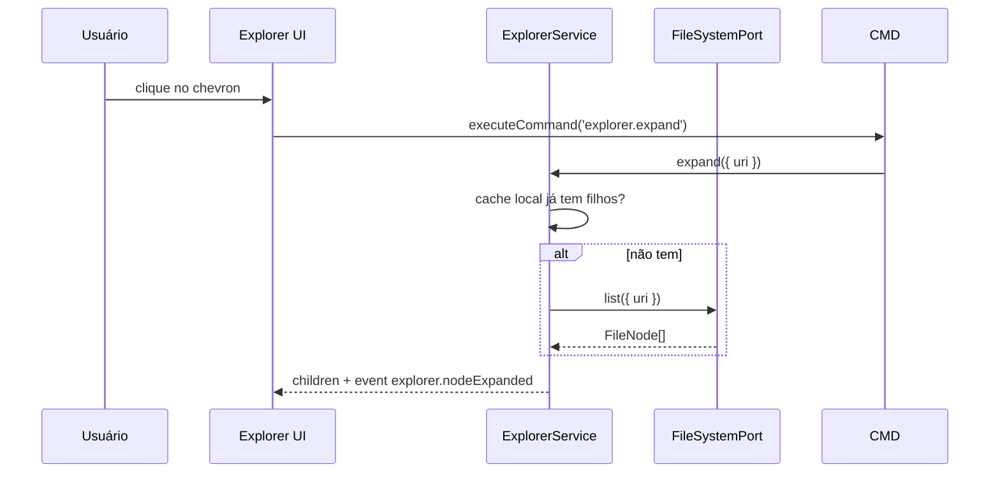

## 2. Criar arquivo / pasta (header ou menu)

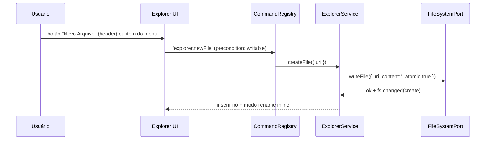

## 3. Menu de contexto → Download para a máquina local

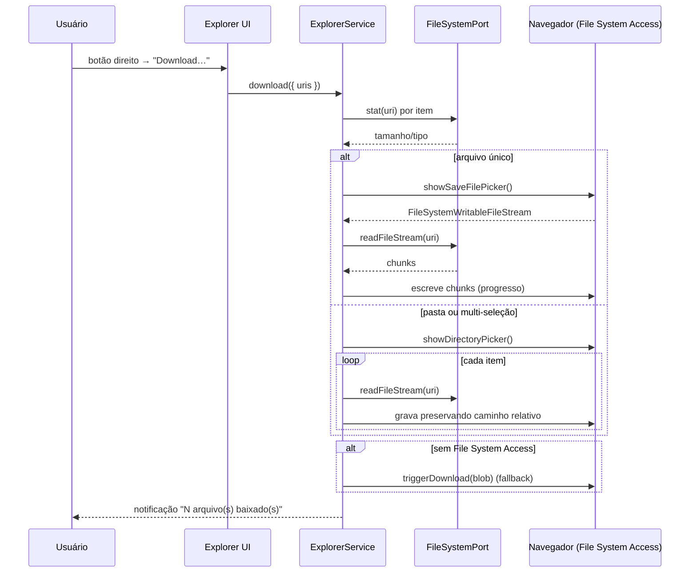

## 4. Upload por drag & drop do Sistema Operacional

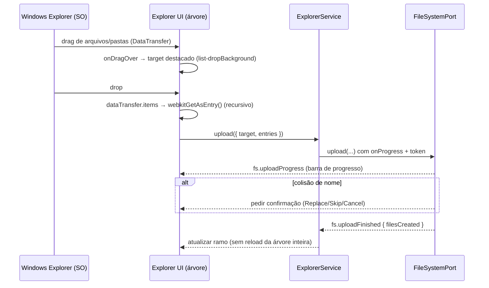

## 5. Abrir arquivo → editor no anexo lateral

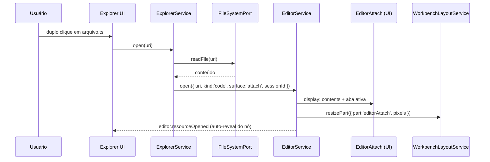

## 6. Fechar a última aba → anexo recolhe (sem destruir)

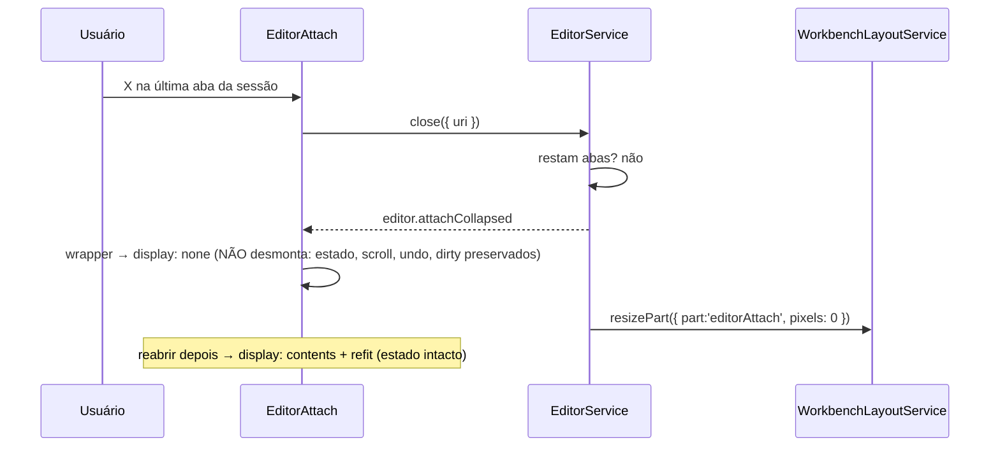

## 7. Pesquisa dentro da sessão

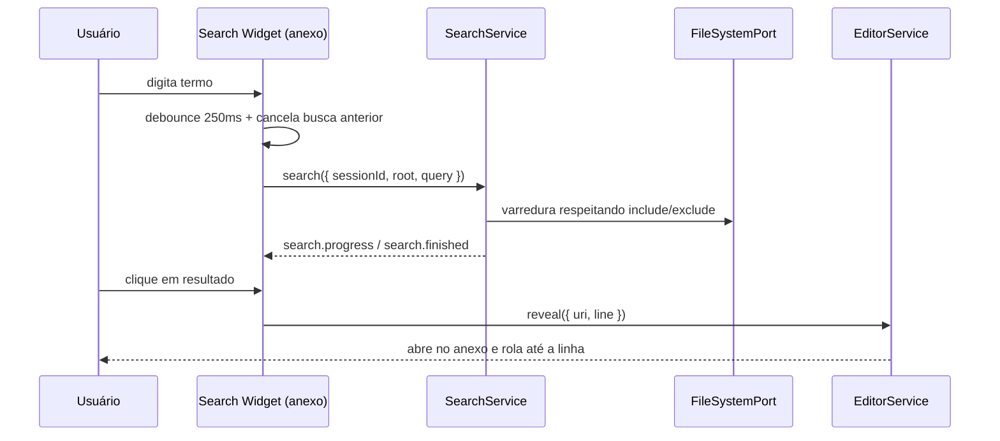

## 8. Abrir navegador pelo “+” do anexo

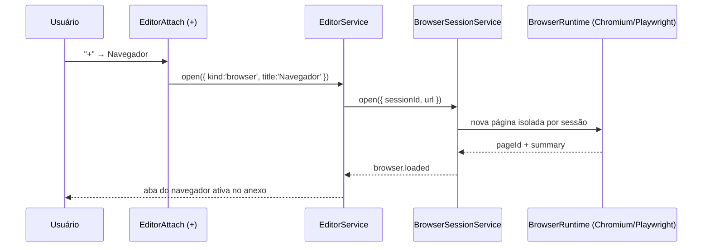

## 9. IA: “o que você está vendo?”

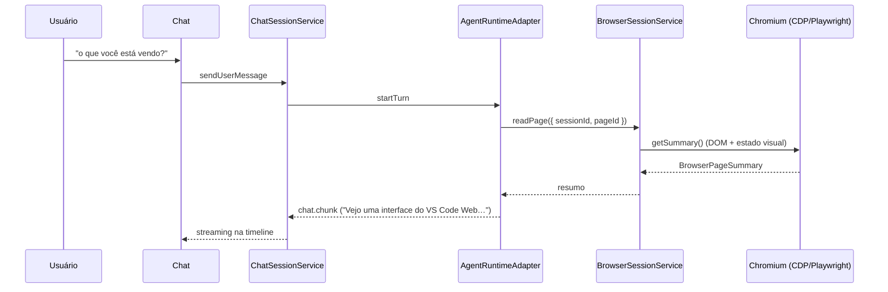

## 10. IA: “clone a página”

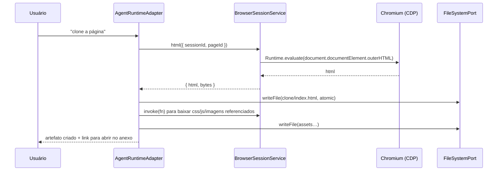

## 11. IA: clique com aprovação humana (tool gate)

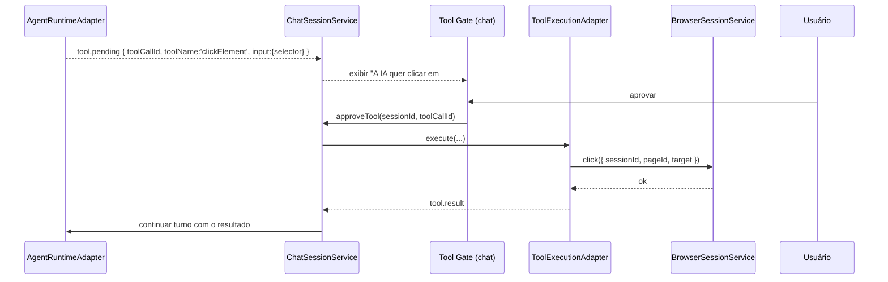

## 12. IA: gravar (filmar) a página

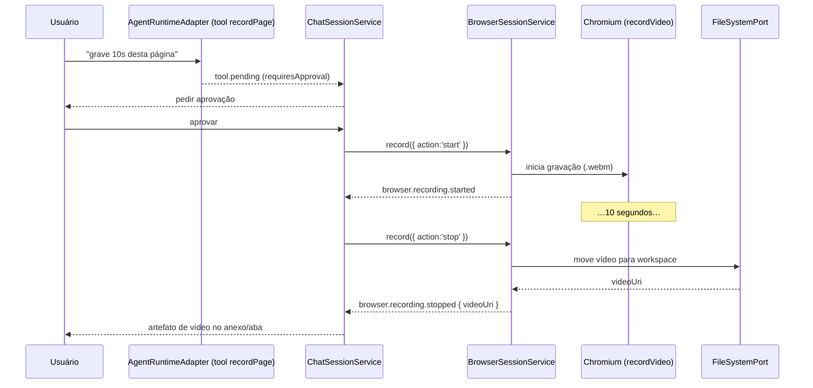

## 13. Ciclo de vida do tema (afeta Explorer/Editor/Search/Browser)

```mermaid
sequenceDiagram
  participant U as Usuário
  participant TH as ThemeService
  participant WB as WorkbenchShell
  participant EX as Explorer UI
  participant ED as EditorAttach
  participant BS as Browser UI
  U->>TH: escolhe tema claro/escuro
  TH-->>WB: theme.changed
  TH-->>EX: theme.changed (tokens --vscode-*)
  TH-->>ED: theme.changed
  TH-->>BS: theme.changed
  Note over EX,BS: nenhum hardcode; terminal blindado usa useTerminalTheme (docs/18 Regra 9)
```

---

## Eixos cobertos (VISUAL / COMPORTAMENTO / EVENTO / VALIDAÇÃO)

| Diagrama | VISUAL esperado | COMPORTAMENTO | EVENTO | VALIDAÇÃO |
|---|---|---|---|---|
| 1 Expandir pasta | filhos indentados, chevron aberto | lazy + cache | `explorer.nodeExpanded` | VAL-EXP-01 |
| 2 Criar arquivo/pasta | input inline na linha | create + rename inline | `fs.changed(create)` | VAL-EXP-04 |
| 3 Download | progresso + notificação | save/directory picker, fallback blob | `fs.download*` | VAL-EXP-07 |
| 4 Upload por DnD | alvo destacado + barra de progresso | webkitGetAsEntry recursivo | `fs.upload*` | VAL-EXP-09 |
| 5 Abrir arquivo | anexo aparece à direita | delegação ao EditorService | `editor.resourceOpened` | VAL-EXP-11 |
| 6 Fechar última aba | anexo recolhe (espaço volta) | `display:none` sem desmontar | `editor.attachCollapsed` | VAL-EXP-13 |
| 7 Search | widget no anexo | debounce + cancelamento | `search.*` | VAL-EXP-15 |
| 8 Abrir browser | aba Navegador | runtime por sessão | `browser.loaded` | VAL-BRW-01 |
| 9 “O que você está vendo?” | resposta no chat | `readPage` → getSummary | `tool.result` | VAL-BRW-02 |
| 10 Clonar página | artefato no workspace | getHTML + assets | `tool.result` | VAL-BRW-03 |
| 11 Clique com gate | prompt de aprovação | aprovação humana antes de executar | `tool.pending` → `tool.result` | VAL-BRW-04 |
| 12 Gravar (filmar) | `.webm` como artefato | start/stop com aprovação | `browser.recording.*` | VAL-BRW-05 |
| 13 Tema | todas as áreas mudam sem reload | tokens | `theme.changed` | RNF-VAL-05 |
