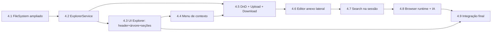

# 04_15 — PLANO DE IMPLEMENTAÇÃO POR SUB-FATIAS (FATIA-04 / FASE 4)

> **Natureza:** plano de execução documental. Nada de código foi alterado nesta fase.
> **Escopo:** Explorer Completo + Editor em Anexo Lateral + Browser com acesso da IA ao HTML.
> **Base contratual:** `docs/03`, `docs/03A`, `docs/04`, `docs/05` (Onda 4 / Épico D), `docs/18` (Regras 1–14).
> **Regra de ouro:** a IA executora **não decide arquitetura** — executa este plano. Dúvida → parar e perguntar (`docs/06`).

---

## 0. Regras invioláveis (valem para todas as sub-fatias)

1. **Nunca** tocar nos blindados do `docs/18`: `VSCodeTerminal.tsx`, `PlatformTerminalBridge.tsx`, `useTerminalTheme.ts`, `terminal-vscode.css`, `vite-plugin-pty.ts`, `platform/services/pty-server/*`, `platform/.../ui/terminal/{useXterm,TerminalGroup,TerminalPanel}` e `.right-section`/`app.css`.
2. **Nunca** remover WebSocket PTY, IPC, listeners de `resize`, `ResizeObserver` ou `MutationObserver` de tema.
3. **Nunca** usar `if (!visible) return null` no anexo do editor — usar `display: visible ? 'contents' : 'none'` (mesmo contrato do `PlatformTerminalBridge.tsx`, **sem importar** do arquivo blindado).
4. Para geometria (largura do anexo, largura da sidebar), preferir **variável CSS local no elemento** + estado React previsível — mesmo padrão homologado do `--terminal-height` (Regra 1 do `docs/18`), evitando `flex`/`height` conflitantes.
5. **Nada de `position: fixed`** cobrindo shell/sidebars/statusbar (Regra 6 por analogia + `09F`).
6. Toda dependência cross-subsistema passa por **contrato** (`docs/04`); `any` em porta de serviço é proibido.
7. **Zero cor hardcoded** nos módulos novos: apenas tokens `--vscode-*`.
8. Ordem obrigatória das sub-fatias: **4.1 → 4.2 → 4.3 → 4.4 → 4.5 → 4.6 → 4.7 → 4.8 → 4.9** (cada uma só começa com a anterior validada).
9. Nenhuma sub-fatia é declarada concluída sem as evidências de §7.

---

## 1. Por que esta ordem (dependências reais)



- **4.1 antes de tudo:** sem `list/readFile/writeFile/stat/createFile/createFolder/copy/download/upload` reais não há árvore, nem menu, nem editor.
- **4.2 antes de 4.3:** a UI não pode nascer com estado próprio (proibido duplicar estado autoritativo do filesystem — `10F`).
- **4.4 antes de 4.5:** Cut/Copy/Paste/DnD compartilham o **clipboard interno** e as confirmações de colisão.
- **4.6 antes de 4.7/4.8:** Search e Browser são **recursos do anexo** (`EditorResource.kind = 'search' | 'browser'`); sem o dono de abas, eles não têm onde viver.
- **4.9 por último:** fecha os eventos transversais (`fs.changed`, `editor.attachCollapsed`, `browser.*`) e roda a homologação completa.

---

## 2. Tabela resumo das 9 sub-fatias

| Sub-Fatia | Arquivos-alvo em `platform/` | Contrato | Validação principal | Testes a criar | Reuso do legado |
|---|---|---|---|---|---|
| **4.1** FileSystem ampliado | `packages/agent-runtime/filesystem/` + `packages/contracts/filesystem.ts` | `FileSystemPort` | unit com fs fake + VAL-FS-01/02 | `filesystemAtomic.test.ts`, `filesystemTransfer.test.ts` | lógica de I/O de `legacy/.../src/domain/fileSystem.ts` (referência de comportamento) |
| **4.2** ExplorerService ampliado | `apps/workbench/src/logic/explorer/` + `packages/contracts/explorer.ts` | `ExplorerService` | unit + VAL-EXP-01 | `explorerService.test.ts` | — |
| **4.3** UI Explorer (header + árvore 22 px + 3 seções) | `apps/workbench/src/ui/explorer/` | — | E2E VAL-EXP-04/05/06 | `sessao_12_explorer.spec.ts` (parte 1) | `legacy/.../components/ContextMenu.tsx` (base do menu), `styles/theme.css` (tokens) |
| **4.4** Menu de contexto completo | `ui/explorer/` + `logic/commands/` | `CommandRegistry.setContext` | VAL-EXP-08 | `explorerContextMenu.test.ts` + `sessao_12_explorer.spec.ts` (parte 2) | `legacy/.../components/ContextMenu.tsx` |
| **4.5** DnD interno + Upload do OS + Download | `logic/explorer/` + `packages/agent-runtime/filesystem/` | `FileSystemPort.upload/download` | VAL-EXP-07/09/10 | `explorerTransfer.test.ts` + fixture de upload | `legacy/.../src/domain/dragAndDrop.ts` (referência) |
| **4.6** Editor em anexo lateral | `logic/editor/` + `ui/editor/EditorAttach.tsx` | `EditorService` (`surface:'attach'`) | VAL-EXP-11/12/13/14 + checagem `display:none` | `editorAttach.test.tsx` + `sessao_13_editor_anexo.spec.ts` | `legacy/.../src/domain/editorTabs.ts`; **contrato** do PlatformTerminalBridge (sem editar o arquivo) |
| **4.7** Search na sessão | `logic/search/` + `ui/editor/` | `SearchService` (novo) | VAL-EXP-15 | `searchService.test.ts` + `sessao_14_search.spec.ts` | `legacy/.../src/domain/search.ts` |
| **4.8** Browser runtime + IA | `services/browser-runtime/` (Playwright) + `logic/browser/` + `packages/contracts/browser.ts` + `packages/tools-sdk/` | `BrowserPort` / `BrowserSessionService` | VAL-BRW-01 a 05 | `browserSession.test.ts` + probe + `sessao_15_browser_ia.spec.ts` | `[E-vscode]` `platform/browserView/common/{playwrightService,browserChatToolReferenceNames}.ts` (nomes das tools) |
| **4.9** Integração final | todos | eventos transversais | checklist A + B do `04_13` | suíte completa + homologação manual | — |

---

## 3. Detalhamento por sub-fatia

### 4.1 — FileSystem ampliado
- **Objetivo:** implementar `FileSystemPort` completo (`list`, `readFile`, `writeFile(atomic)`, `move`, `copy`, `remove`, `watch`, `stat`, `createFile`, `createFolder`, `download`, `upload`, `readFileBinary`).
- **Arquivos-alvo:** `platform/packages/agent-runtime/filesystem/{fileHost.ts,nodeFileSystemPort.ts,browserTransfer.ts,index.ts}`; contrato em `platform/packages/contracts/filesystem.ts` (proposta `04_10` §1).
- **Regras:** escrita atômica sempre (`temp + rename`); serialização por recurso (fila/barreira) para não corromper sob concorrência; **zero** escrita parcial em falha; path traversal rejeitado.
- **Entregável:** porta funcional + adaptador web (transferência browser↔workspace) + testes com fs fake.
- **Validação:** `VAL-FS-01` (salvar = atômico e persistido), `VAL-FS-02` (concorrência não corrompe), novo `VAL-FS-03` (upload/download íntegros por hash).
- **Critério de pronto:** unit verdes; `tsc --noEmit` 0 erros; nenhuma API fora do contrato.
- **Não fazer:** usar `fs` direto em componentes; criar API paralela ao contrato.

### 4.2 — ExplorerService ampliado
- **Objetivo:** transformar os 6 métodos atuais em serviço completo (create/rename/delete/cut/copy/paste/download/upload/collapseAll/setSortOrder/select/getSelection/getClipboardState + os existentes).
- **Arquivos-alvo:** `platform/apps/workbench/src/logic/explorer/{explorerService.ts,index.ts}`; contrato `platform/packages/contracts/explorer.ts`.
- **Regras:** o serviço **coordena**; leitura/escrita é do `FileSystemPort`; abrir é do `EditorService`; publica context keys.
- **Entregável:** serviço + eventos (`explorer.nodeExpanded/Collapsed`, `selectionChanged`, `fileOpened`, `revealRequested`).
- **Validação:** `VAL-EXP-01` (list chamado 1× por pasta), `VAL-EXP-05` (reveal), unit `explorerService.test.ts`.
- **Critério de pronto:** unit verdes; nenhuma regra de negócio na UI; context keys publicadas.
- **Não fazer:** manter estado autoritativo próprio do FS; carregar árvore inteira.

### 4.3 — UI Explorer (header + árvore + seções)
- **Objetivo:** sidebar com header de **5 alvos** (new-file, new-folder, refresh, collapse-all, overflow), árvore **lazy de 22 px** com ícones/estados, e as **3 seções** (Editores Abertos / Linha do Tempo / Estrutura de Código) com estados vazios.
- **Arquivos-alvo:** `platform/apps/workbench/src/ui/explorer/{ExplorerView.tsx,ExplorerTree.tsx,ExplorerHeader.tsx,OpenEditorsSection.tsx,TimelineSection.tsx,OutlineSection.tsx,explorer.css}`.
- **Visual:** tokens `--vscode-sideBar-background`, `--vscode-list-activeSelectionBackground/HoverBackground`, `--vscode-focusBorder`, `--vscode-list-dropBackground`; altura de linha 22 px; estados hover/ativo/inativo/erro.
- **Validação:** `VAL-EXP-02` (abrir arquivo), `VAL-EXP-04` (criar), `VAL-EXP-06` (estado vazio “Nenhum editor aberto”), **grep de hardcode = 0**.
- **Critério de pronto:** E2E `sessao_12_explorer.spec.ts` parte 1 verde; nenhuma cor literal.
- **Não fazer:** trazer regra de negócio para o componente; criar estado paralelo de arquivos.

### 4.4 — Menu de contexto completo
- **Objetivo:** menu com grupos/ordem/`when` do `04_03` (New File, New Folder, Open to the Side, Cut, Copy, Paste, **Download**, Upload, Copy Path, Rename, Delete/Move to Trash).
- **Arquivos-alvo:** `ui/explorer/ExplorerContextMenu.tsx`; ações em `logic/commands/` (`commandRegistry` já existe).
- **Regras:** itens habilitados por **context keys** (`explorerResourceIsFolder`, `IsRoot`, `Writable`, `ParentReadOnly`, `MoveableToTrash`, `resourceCopied`, `multiSelect`); nenhuma lógica de negócio inline no menu (dispara comandos).
- **Validação:** `VAL-EXP-08`; matriz de habilitação do `04_03` §2 testada item a item.
- **Critério de pronto:** teclado funciona (setas/Enter/Esc), aria correto, 0 lógica inline.
- **Não fazer:** hardcodar habilitação por `if` de tipo de nó espalhado; duplicar comandos.

### 4.5 — DnD interno + Upload do OS + Download
- **Objetivo:** upload por arrastar do SO (arquivos **e pastas**, recursivo, com progresso/cancelamento/colisão), download para a máquina local (save picker / directory picker / fallback blob), e DnD interno (mover/copiar com `Alt`).
- **Arquivos-alvo:** `logic/explorer/transferController.ts`; `packages/agent-runtime/filesystem/browserTransfer.ts`.
- **Regras:** `DataTransferItem.webkitGetAsEntry()` para recursão; detecção de File System Access API com fallback; progresso sem bloquear a UI; confirmação de sobrescrita; path traversal rejeitado.
- **Validação:** `VAL-EXP-07` (download), `VAL-EXP-09` (upload), `VAL-EXP-10` (DnD interno).
- **Critério de pronto:** upload de pasta com 20 arquivos replica a estrutura; download de binário grande íntegro por hash; cancelamento não deixa arquivo parcial.
- **Não fazer:** carregar arquivo inteiro na memória quando há stream; sobrescrever sem confirmar.

### 4.6 — Editor em anexo lateral
- **Objetivo:** abas **por sessão** dentro de um anexo à direita da árvore; sash 6 px; recolher quando fechar a última aba **sem desmontar**.
- **Arquivos-alvo:** `logic/editor/editorService.ts`, `ui/editor/{EditorAttach.tsx,EditorTabs.tsx,EditorContent.tsx,editor-attach.css}`.
- **Contrato:** `EditorResource { surface:'attach', sessionId }`, `setAttachVisible` (troca `display`), `setAttachWidth` (clamp 280–1200 px / 25–75%), `closeAll`.
- **Regras:** `display: contents | none` (nunca desmontar); largura em variável CSS local (`--editor-attach-width`) no elemento; nunca `position: fixed`; salvar via `FileSystemPort.writeFile({atomic:true})`.
- **Validação:** `VAL-EXP-11` (abre no anexo), `VAL-EXP-12` (sash + persistência), `VAL-EXP-13` (recolhe e volta intacto), `VAL-EXP-14` (maximizar não cobre shell + `display:none` verificado no DOM).
- **Critério de pronto:** teste que assegura **0 chamadas de unmount** ao recolher; scroll/cursor/undo preservados; E2E `sessao_13_editor_anexo.spec.ts` verde.
- **Não fazer:** tocar `App.tsx`/`EditorArea.tsx` do legado (Q1); usar `height` fixo conflitante com `flex-basis`.

### 4.7 — Search na sessão
- **Objetivo:** busca com escopo da sessão (aba `search` do anexo), com toggles, include/exclude, substituição e estados vazios.
- **Arquivos-alvo:** `logic/search/searchService.ts`, `ui/editor/SearchPanel.tsx`.
- **Regras:** debounce 250 ms; cancelamento (última busca vence); ignorar `node_modules/.git/dist/build/out/.next`; substituir via `writeFile(atomic)`.
- **Validação:** `VAL-EXP-15`; unit de debounce/cancelamento/limites.
- **Critério de pronto:** clique em resultado abre no anexo na linha correta; contagem e plural corretos.
- **Não fazer:** rodar busca no thread principal sem debounce; manter resultados de busca antiga.

### 4.8 — Browser runtime + IA com acesso a HTML (**crítico**)
- **Objetivo:** navegador real dentro do anexo (botão `+`), com runtime **Chromium + Playwright/CDP por sessão** e as 10 tools canônicas + `recordPage`.
- **Arquivos-alvo:** `platform/services/browser-runtime/{index.ts,playwrightRuntime.ts,screencast.ts,recorder.ts}`; `logic/browser/browserSessionService.ts`; `packages/contracts/browser.ts`; tools em `packages/tools-sdk/browser/*`.
- **Tools (nomes canônicos):** `openBrowserPage`, `listBrowserPages`, `readPage`, `screenshotPage`, `navigatePage`, `clickElement`, `typeInPage`, `hoverElement`, `dragElement`, `handleDialog`, `runPlaywrightCode`, **`recordPage`** (nova).
- **Segurança:** isolamento por sessão (userDataDir próprio); permissões negadas por padrão; filtro de rede; **aprovação humana** para click/type/drag/handleDialog/runPlaywrightCode/recordPage; `getHTML` não expõe cookies.
- **Validação:** `VAL-BRW-01…05` (abrir, ler, clonar, interagir com gate, gravar) + probe técnico.
- **Critério de pronto:** “o que você está vendo?” responde com conteúdo real; clone grava HTML+assets; `.webm` reproduzível; 2 sessões isoladas.
- **Não fazer:** iframe cross-origin como fonte de HTML; executar tool sem gate; expor segredos.

### 4.9 — Integração final
- **Objetivo:** fechar eventos transversais (`fs.changed` → árvore/editor/outline), `editor.attachCollapsed`, `browser.*`, persistência de layout versionada, e rodar a homologação completa.
- **Validação:** checklist **A** (vídeo) e **B** (14 itens do `docs/18`) do `04_13`, item a item; suíte completa (`vitest run`, specs novos, `sessao_11_terminal_pty_real` 6/6).
- **Critério de pronto:** nenhum item de B pendente; build de integração **apenas** neste marco.

---

## 4. Protocolo de testes (inventário real, 2026-09-16)

### 4.1 Inventário verificado no pacote

| Conjunto | Quantidade real | Como rodar | Observação |
|---|---|---|---|
| Unit Vitest do projeto | **52** arquivos em `legacy/.../02_replica_final/src/__tests__/*.test.{ts,tsx}` | `npm run test` (na raiz do projeto) | `vitest.config.ts` com `include: ['src/**/*.{test,spec}.{ts,tsx}']` e **threshold 90%** |
| E2E Playwright do projeto | **19** arquivos em `legacy/.../02_replica_final/e2e/*.spec.ts` | `npx playwright test` | inclui `sessao_11_terminal_pty_real.spec.ts` (**6/6 blindados**) |
| Testes do VS Code original | milhares em `code-server/lib/vscode/**/test/**` | **NÃO RODAR** | exigiria compilar o VS Code inteiro; são apenas referência |

### 4.2 Specs novos a criar (seguindo o modelo de `sessao_11d_split_sash.spec.ts`)

| Spec | Cobre | RFs |
|---|---|---|
| `e2e/sessao_12_explorer.spec.ts` | header (5 botões), árvore lazy 22 px, seções + estado vazio, criar/renomear/excluir, menu de contexto + Download | RF-01…RF-18 |
| `e2e/sessao_13_editor_anexo.spec.ts` | abre no anexo (não no centro), sash 6 px + persistência, recolhe sem desmontar, reabre intacto, maximizar não cobre shell | RF-19…RF-23 |
| `e2e/sessao_14_search.spec.ts` | busca na sessão, debounce, resultado → reveal, estado vazio, substituir | RF-24 |
| `e2e/sessao_15_browser_ia.spec.ts` | `+` abre navegador, “o que você está vendo?”, clone, clique com gate de aprovação, gravação | RF-25…RF-30 |
| `e2e/sessao_11_terminal_pty_real.spec.ts` (existente) | **anti-regressão** | deve continuar **6/6** |

### 4.3 Comandos do ciclo

```bash
# 0) typecheck (rápido, sempre)
npm run typecheck:contracts
npx tsc --noEmit

# 1) unit focado do subsistema alterado
npx vitest run platform/apps/workbench/tests/unit/<arquivo>.test.ts

# 2) suíte unit completa (52 arquivos) + coverage 90%
npm run test -- --coverage

# 3) E2E novo do subsistema
npx playwright test e2e/sessao_12_explorer.spec.ts

# 4) ANTI-REGRESSÃO obrigatória antes de fechar qualquer sub-fatia
npx playwright test sessao_11_terminal_pty_real
```

### 4.4 Ambiente (obrigatório antes de qualquer E2E)

1. **VS Code (code-server) na 8080 continua de pé** — nunca derrubar (`npm run dev` do Vite **não** sobe o code-server).
2. Frontend: `npm run dev` → **5173**; conferir `curl -s -o /dev/null -w "%{http_code}" http://localhost:5173` = **200**.
3. PTY: `npm run dev:pty` / `platform/services/pty-server` — conferir o WS `/pty` respondendo (`opened`).
4. `/tmp` com folga: `df -h /tmp` — se >90%, limpar **antes** de qualquer build (`rm -rf /tmp/tmp.*`).
5. Atenção ao ambiente: ~1,9 GB de RAM no total — subir Vite + Playwright juntos exige cuidado; se faltar memória, avisar e reerguer no mesmo turno.

---

## 5. Loop de validação fechado (o “segredo” do modelo de referência)

Para **cada** sub-fatia, depois dos testes automatizados:

1. Abrir `http://localhost:5173` no navegador real (ferramenta de browser, se disponível).
2. Executar a **ação humana** correspondente (clicar no botão, expandir, arrastar o sash, arrastar arquivo do SO, botão direito → Download, `+` → Navegador, perguntar “o que você está vendo?”).
3. Capturar **screenshot** e **console**.
4. Comparar com `docs/referencias_visuais/` (categorias `explorer/`, `editor/`, `terminal/`, `tabs_breadcrumbs/`, `workbench/`).
5. **Loop de autocorreção — sem perguntar ao usuário:** se algo estiver torto (sash não arrasta, save picker não abre, console com erro, anexo cobrindo sidebar):
   - ler console/erro;
   - localizar a **linha exata** (ex.: `EditorAttach.tsx` no cálculo de clamp da largura);
   - corrigir;
   - retestar até bater 100% com a referência;
   - repetir no máximo até convergir — e, se travar por limite de ambiente, **registrar o bloqueio com honestidade** (nunca inventar sucesso).
6. Casos de borda obrigatórios: 0 arquivos (estado vazio “Nenhum editor aberto”), 1 arquivo (sem sidebar de abas), multi-seleção com Download, arquivo somente-leitura, pasta vazia.

---

## 6. Gestão de ambiente e riscos

| Risco | Mitigação nesta fase |
|---|---|
| **RISK-01/02** — dual implementação legado × `platform/` | Explorer/Editor/Search/Browser nascem **só** em `platform/`; integração por bridge; legado intocado (Q1) |
| **RISK-03** — OOM de build (Monaco) no ambiente | validar por dev server + typecheck; build completo só em 4.9 |
| Reset do sandbox apaga `.cache`, `node_modules`, `out` | código-fonte vive em `a/` + `projeto_restaurado.zip`; re-clone do VS Code e re-extração são passos documentados |
| `/tmp` (993 MB) estourando | `TMPDIR` apontando para disco grande em downloads/builds; limpar `tmp.*` antes de build |
| RAM (~1,9 GB) | não rodar Vite + build + Playwright simultâneos sem necessidade; prioridade absoluta: VS Code 8080 no ar |

---

## 7. Definição de pronto (DoD) e evidências exigidas por sub-fatia

Uma sub-fatia só é dada como concluída com **todas** as evidências abaixo, anexadas ao relato final no chat (não em arquivo extra, salvo pedido):

1. lista de arquivos **criados/alterados** com caminho real;
2. saída de `npm run typecheck:contracts` e `npx tsc --noEmit` (**0 erros**);
3. saída dos testes focados (nomes + contagem de passou/falhou);
4. resultado do E2E do subsistema (spec + passou/falhou + tempo);
5. `npx playwright test sessao_11_terminal_pty_real` = **6/6** (anti-regressão);
6. verificação do item “visual/comportamento” no navegador real (screenshot descrito);
7. pendências, riscos e itens **não testados** explicitados.

> **Regra final:** percentuais só se o usuário pedir; conclusão só com evidência; qualquer desvio arquitetural → parar e perguntar (`docs/06`).

---

## 8. Eixos cobertos (VISUAL / COMPORTAMENTO / EVENTO / VALIDAÇÃO)

| Eixo | Como o plano garante |
|---|---|
| **VISUAL** | §3 — cada sub-fatia declara o efeito visual esperado (4.3 header+árvore 22 px, 4.5 feedback de drop/progresso, 4.6 anexo+sash, 4.7 widget de busca, 4.8 aba Navegador) e a regra de **zero hardcode** (§0.7). |
| **COMPORTAMENTO** | §3 — objetivo, regras e “não fazer” de cada sub-fatia; §1 — ordem obrigatória com justificativa de dependência. |
| **EVENTO** | §3 — eventos por sub-fatia (`explorer.*`, `fs.changed`, `editor.attach*`, `search.*`, `browser.*`) e §4.2 (specs que os exercitam). |
| **VALIDAÇÃO** | §2 (VAL-* por sub-fatia), §4 (protocolo de testes com inventário real), §5 (loop fechado + autocorreção), §7 (DoD e evidências obrigatórias). |
