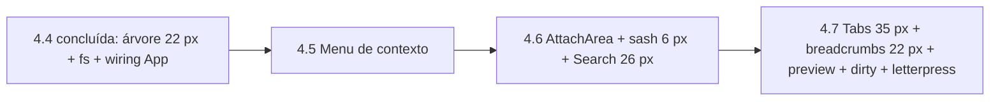

# 04_18 - Plano de Implantação FATIA-04

**Status:** PLANEJAMENTO (nenhuma linha de código nesta fase) · **Criado:** 2026-09-22
**Fonte única da verdade para medidas e estados:** `docs/engenharia_reversa/FATIA-04_VIDEO_COMPLETO/04_17_explorer_codeeditorpane_raspagem_vscode_original.md` (a "04_17"). Todo número em px e todo token deste plano foi copiado da 04_17 — nada foi inventado. Onde a 04_17 declara "não medido", este plano diz "validar na homologação".
**Documentos que este plano obedece:** `04_15` (ordem 4.5 → 4.6 → 4.7 e regras invioláveis §0), `04_10` (contratos congelados: `contract.ts` — `IEditorAttachApi`, `IExplorerSearchModuleDeps.contextMenu`), `docs/18` (anti-regressão; Regra 10: recolher = `display:none`, nunca desmontar), `docs/16` §3.2 (LEGO: módulo isolado dentro do monolito).
**Módulo alvo:** `platform/apps/workbench-v2/src/modules/explorer-search/` (Casa Nova, Single Port 5174).

---

## 1. Resumo Executivo

Ao final da FATIA-04 (sub-fatias 4.5, 4.6 e 4.7) o Agente Window terá, **dentro do módulo isolado `explorer-search`**, sem microserviço e sem centralizar lógica no `App.tsx`:

1. **Menu de contexto completo da árvore** (4.5) — tabela declarativa com grupos, ordem, keybinding na coluna direita e `when` por context key, com a mesma geometria do original (item **24 px**, container radius **8 px**, label padding **0 26px**, separador **1 px / margin 5px 0**).
2. **Área do anexo lateral à direita** (4.6) — o "Visualizador de Contexto": redimensionável por **sash de 6 px** (decisão do projeto; o original usa **4 px**), recolhível **sem desmontar** (`display:none`), largura persistida, hospedando a aba Search com inputbox de **26 px** e resultados em linhas de **22 px**.
3. **Editor em anexo com abas fiéis ao original** (4.7) — faixa de tabs **35 px**, aba ativa com borda de **1 px no topo** (`--vscode-tab-activeBorderTop`), **preview em itálico** (uma por grupo), **dirty ●** que vira **✕** no hover, **breadcrumbs 22 px** com separador `chevron-right`, e **estado vazio com letterpress 256×256 px** + atalhos em chips `--vscode-keybindingLabel-*`.

Métrica de sucesso: **paridade visual e de UX com a 04_17** medida por print lado a lado (§5), com Terminal homologado intocado (anti-regressão 9/9 + 10/10 conforme `docs/12`).

---

## 2. Premissas de Layout do Agente Window

| Premissa | Detalhe | Origem |
|---|---|---|
| **Explorer à esquerda, 260–300 px** | Painel lateral esquerdo (aba Files da barra auxiliar). Largura de referência medida no original: **300 px** (`.part.sidebar` 300×843). Mínimo do projeto: 260 px. | 04_17 §3.1 |
| **Search dentro do Explorer, à esquerda** | O widget de busca (inputbox **26 px**, toggles **20×20**, toggle-replace **16 px** à esquerda) vive no mesmo painel do Explorer, não em view separada. Resultados em árvore arquivo → match, **22 px/linha**. | 04_17 §5 |
| **CodeEditorPane = Visualizador de Contexto à direita** | Não é o centro fixo. É superfície **colapsável** à direita da árvore. | 04_15 §4.6/4.7 (Q1) |
| **Colapsar = `display:none` sem desmontar Monaco** | `IEditorAttachApi.setVisible()` NUNCA desmonta; modelo Monaco (cursor/scroll/undo) permanece vivo. Espelho da Regra 10 do `docs/18`. | `contract.ts` §IEditorAttachApi; 04_15 §0.8 |
| **Redimensionável via sash 6 px** | `ATTACH_SASH_WIDTH_PX = 6` (congelado em `core/constants.ts`), governado por CSS var `--attach-width`; clamp **280–1200 px / 25–75 %**. Original: `--vscode-sash-size: 4px`, hover → `--vscode-sash-hoverBorder` após 300 ms, duplo clique redistribui. Comportamento do hover/dblclick é portado; a espessura é a do projeto (6 px). | 04_17 §4.6; `constants.ts` |
| **Lógica agnóstica à posição** | Tudo o que a 04_17 descreve como altura, cor, estado, evento e ordem é portado; nada depende de "x absoluto" nem de "lado esquerdo/direito". Onde o original assume esquerda (twistie antes do label, toggle-replace antes dos inputs), o Agente Window mantém a **ordem relativa dentro do componente**; só o **container** muda de lado. | 04_17 §0 |
| **Zero cor hex** | Somente tokens `--vscode-*` (tabela 04_17 §2). Os fallbacks atuais em `explorer.css` (`#21252b`, `#26292f`, `#007fd4`) estão marcados como lacuna 14 na 04_17 §8 e serão substituídos pelos tokens Dark Modern (`--vscode-sideBar-background`, `--vscode-focusBorder`) — sem hex literal. | 04_15 §0.7; 04_17 §8 |

---

## 3. Dependências e Ordem

**Ordem obrigatória: 4.5 → 4.6 → 4.7** (04_15 §0.11 e §1). Justificativa técnica, derivada da 04_17:

1. **4.5 antes de 4.6** — o menu de contexto depende **apenas** do que já existe (árvore 22 px, `deps.menus`, `deps.contextMenu` já injetado pelo `App.tsx` desde 4.4). Não requer o anexo. Entregá-lo primeiro fecha o Explorer (lado esquerdo) como peça LEGO completa antes de abrir a superfície direita. Além disso, itens do menu da 4.5 (`Open to the Side`, `Find in Folder…` → Search com include pré-preenchido, `Open Preview`) **produzem eventos** que 4.6/4.7 consomem; definir os IDs de comando primeiro evita retrabalho.
2. **4.6 antes de 4.7** — o anexo (container, sash 6 px, `setVisible/setWidth`, persistência, `display:none`) é **a casa** onde as abas de código vão morar. A aba Search é o primeiro inquilino porque é mais simples (sem Monaco, sem dirty, sem preview) e já valida A5.2/A5.3/A5.7 (sash, 0 unmounts, sem `position:fixed`). Colocar Monaco antes do container estar homologado misturaria dois riscos (layout + editor) numa única entrega.
3. **4.7 por último** — depende de 4.5 (comando `Open Preview` / clique simples = preview) e de 4.6 (área, sash, recolhimento). É a fatia com maior densidade de aparência (tabs, breadcrumbs, dirty, letterpress) e, portanto, a que mais precisa do checklist §5 já calibrado nas anteriores.

**Pré-condições comuns (gates):** `tsc` limpo; vitest do módulo verde; anti-regressão terminal + layout verdes; `git grep -nE '#[0-9a-fA-F]{3,8}\b|rgba?\(' -- src/modules/explorer-search/ui/*.css` = 0 ocorrências.

---

## 4. Detalhamento por Sub-Fatia

### Fatia 4.5 - Menu de Contexto Completo da Árvore

**Origem (04_17):** §3.8 (menu medido) + §6.1 linha "Menu de contexto" (status ✗) + §8 lacuna 10 — gap da tabela `fileActions.contribution.ts:478–680` (grupos `navigation`, `2_workspace`, `3_compare`, `4_search`, `5_cutcopypaste`, `5b_importexport`, `6_copypath`, `7_modification`).

**Estado atual (04_17 §6.1):** `ContextMenu.tsx` do shell com item `padding 5px 10px` (~28 px), **sem coluna de keybinding**, subset da 4.4 (poucos itens).

**O que fazer (planejar, não codar):**

| # | Item | Especificação (da 04_17) |
|---|---|---|
| 1 | Tabela declarativa `core/menus/explorerMenus.ts` | Portar grupos/ordem de `fileActions.contribution.ts:478–680`. Ordem medida para **pasta**: New File… · New Folder… · Open in Integrated Terminal ‖ Find in Folder… `Shift+Alt+F` ‖ Cut `Ctrl+X` · Copy `Ctrl+C` · Paste `Ctrl+V` ‖ Download… · Upload… ‖ Copy Path `Ctrl+Alt+C` · Copy Relative Path `Ctrl+Shift+Alt+C` ‖ Rename… `F2` · Delete `Del`. Para **arquivo**: Open Preview · Open to the Side `Ctrl+Enter` · Open in Integrated Terminal ‖ Cut · Copy ‖ Download… ‖ Copy Path · Copy Relative Path ‖ Rename… · Delete. Fora de escopo (04_11 §11-C): Add/Remove Folder, Select for Compare, Open With, Open Timeline, Add to Chat, Open in Images Preview. |
| 2 | Grupos e separadores | Grupos nomeados `navigation`, `2_workspace`, `4_search`, `5_cutcopypaste`, `5b_importexport` (Download + Upload), `6_copypath`, `7_modification`; separador entre grupos. Labels PT-BR conforme `04_01`. |
| 3 | `when` / context keys | Publicar em cada `selectionChanged`/operação: `explorerResourceIsFolder`, `explorerResourceIsRoot`, `explorerResourceParentReadOnly`, `resourceCopied`, `resourceCut`, `explorerViewletVisible`, `listMultiSelection` (conjunto congelado `04_10 §2.4`). Paste desabilitado sem clipboard (original: `.disabled` opacity 0.4). |
| 4 | Geometria do menu (adapter `deps.contextMenu`) | Container: radius **8 px**, borda **1 px `--vscode-menu-border`**, bg `--vscode-menu-background`, sombra `0 0 12px` `--vscode-widget-shadow`, padding vertical 4 px. Item: **24 px** de altura, label **13 px**, padding **0 26px**, radius **6 px**; keybinding na **coluna direita** (mesma cor, padding-right 26). Hover/foco: bg `--vscode-menu-selectionBackground`, texto `--vscode-menu-selectionForeground`. Separador: **1 px** `--vscode-menu-separatorBackground`, margin **5px 0**. Disabled: opacity 0.4. Largura medida 348 px (cresce com maior label + keybinding). |
| 5 | Comportamento | Botão direito na linha → linha ganha `.focused` e o menu abre no cursor; clique em área vazia → menu da raiz; ↑↓ navega, Enter ativa, Esc fecha **e devolve foco à árvore**; após fechar, linhas perdem outline (`context-menu-visible` → `outline:none`). |
| 6 | Atalhos diretos (sem menu) | F2, Del, Ctrl+C/X/V, Ctrl+Alt+C, Ctrl+Shift+Alt+C, Shift+Alt+F, Ctrl+Enter — mesmos IDs de comando da tabela. |
| 7 | Fronteira LEGO | O módulo só chama `deps.contextMenu.open({ x, y, items })` e `deps.menus.execute(id)`. `components/ContextMenu.tsx` do shell é intocável; se a geometria do shell divergir da 04_17, a divergência é registrada como gap do shell, não corrigida dentro do módulo. |

**Arquivos previstos:** cria `core/menus/explorerMenus.ts`, `__tests__/menus/*.test.ts`, `e2e/sessao_12_explorer.spec.ts` (parte 2). Altera: nenhum no `App.tsx` (dep já existe). Intocáveis: terminal, `ContextMenu.tsx` do shell, `vite-plugin-pty.ts`.

**Critério de pronto:** **25+ comandos** registrados na tabela declarativa, cada um com `when` testado item × contexto (arquivo, pasta, raiz, multi, clipboard vazio/cheio); matriz `04_03 §2` verde; teclado e aria conforme item 5; `VAL-EXP-08`; A3.1–A3.5; print lado a lado do menu (pasta e arquivo) com medidas 24 px/8 px/26 px confirmadas; anti-regressão terminal verde.

---

### Fatia 4.6 - Integração do Anexo Lateral

**Origem (04_17):** §4.6 (split/sash/overlay), §4.8 (comportamento ao colapsar/expandir: restaurar largura salva, manter estado, foco), §5 (Search), §6.2 linhas "Sash" e "Colapsável", §8 lacunas 16–18 e 30 — gap "Sash e Recolhimento sem Unmount".

**Estado atual (04_17 §6.2):** `.panel-resize-handle` de **1 px**; `sidePaneState` closed/detail-only/editor+detail no shell; nenhuma área de anexo no módulo; Search do shell (`EditorArea.tsx`) é lista plana com input próprio, sem toggles nem árvore de resultados.

**O que fazer (planejar, não codar):**

| # | Item | Especificação (da 04_17 / contrato) |
|---|---|---|
| 1 | `ui/AttachArea.tsx` + `ui/attach.css` | Container à direita da árvore governado por `--attach-width`; `setWidth` com clamp **280–1200 px / 25–75 %**; largura persistida por workspace e restaurada ao reabrir (04_17 §4.8). |
| 2 | Sash **6 px** | `ATTACH_SASH_WIDTH_PX = 6`; `cursor: ew-resize`; hover → bg `--vscode-sash-hoverBorder` após **300 ms** (original); **duplo clique** redistribui para a largura padrão; teclado: foco no sash + ←→ ajusta. Borda entre superfícies: **1 px** `--vscode-editorGroup-border`. |
| 3 | Recolhimento total sem unmount | `setVisible(false)` aplica `display:none` no container; `closeAll` → recolhe. Zero `unmount` do React e do Monaco (teste "0 unmounts"). Reabrir restaura largura anterior e **foca o conteúdo** (04_17 §4.8: foco vai ao editor, não à aba). Sem `position:fixed` (A5.7). |
| 4 | Aba Search no anexo — widget | Inputbox **26 px** (`textarea` 24 px, padding `3px 0 3px 6px`, 13 px), bg `--vscode-input-background`, borda 1 px `--vscode-input-border`, radius **4 px**; foco: outline **1 px** `--vscode-focusBorder`; placeholder "Search"/"Replace" em `--vscode-input-placeholderForeground`. Três toggles **20×20** (case-sensitive Alt+C, whole-word Alt+W, regex Alt+R) com ativo = bg `--vscode-inputOption-activeBackground` + borda `--vscode-inputOption-activeBorder`, hover `--vscode-inputOption-hoverBackground`; toggle-replace **16 px** de largura à frente dos inputs; details (`…`) com "files to include" (placeholder `e.g. *.ts, src/**/include`) e "files to exclude" + toggle "Use Exclude Settings and Ignore Files" (ligado por padrão). |
| 5 | Aba Search — resultados | Mensagem `N results in M files` em `--vscode-search-resultsInfoForeground` (margin-top −5 px). Árvore: linha de arquivo **22 px** (ícone + nome + caminho em `label-description` + badge `--vscode-badge-background`), linhas de match **22 px** indentadas **8 px**, highlight `--vscode-editor-findMatchHighlightBackground`; hover mostra ações inline Replace/Dismiss (**não medido** na 04_17 — validar na homologação). Clique em match → `attach.open({ uri, line })` em modo preview; Enter → pinado; Ctrl+Enter → ao lado. |
| 6 | Serviço de busca | `searchService` com debounce **250 ms** (congelado `constants.ts`; original 300 ms — manter o congelado), cancelamento "última busca vence", excludes padrão congelados, `maxResults 2000 / maxFiles 500 → truncated`, endpoint aditivo `POST /fs/search`. |
| 7 | Wiring no `App.tsx` | Apenas montagem do `AttachArea` ao lado da árvore e roteamento de eventos (`search.resultOpened`, `attach.closed` → layout). Nenhuma lógica de layout do anexo no App. |

**Arquivos previstos:** cria `ui/AttachArea.tsx`, `ui/SearchPanel.tsx`, `ui/attach.css`, `core/search/{queryBuilder,model,replace,searchService}.ts`, `server/fs/searchEngine.ts`, `e2e/sessao_14_search.spec.ts`. Altera: `App.tsx` (aditivo), `server/fs/index.ts` (+`/fs/search`). Intocáveis: terminal, `EditorArea.tsx` do shell, `vite-plugin-pty.ts`.

**Critério de pronto:** **fechar a última aba esconde o anexo** (`display:none` verificado no DOM, container continua montado); **reabrir preserva cursor/scroll/undo** (com a aba Search: preserva query, toggles e scroll dos resultados — cursor/undo do Monaco são validados na 4.7 sobre a mesma infra); sash 6 px arrastável com hover azul após 300 ms e dblclick reset; largura sobrevive a reload (A5.2); 0 unmounts (A5.3); sem `position:fixed` (A5.7); A6.1–A6.3, A6.5, A6.6; A6.4 parcial; print lado a lado do widget (26 px) e da lista (22 px); anti-regressão terminal verde.

---

### Fatia 4.7 - Breadcrumbs, Preview e Empty State

**Origem (04_17):** §4.2 (tabs), §4.3 (UX das tabs), §4.4 (breadcrumbs 22 px), §4.5 (toolbar), §4.7 (estado vazio / letterpress), §6.2 (status ✗ em preview, dirty, breadcrumbs, borda da aba ativa), §8 lacunas 19–29.

**Estado atual (04_17 §6.2):** aba ativa com borda azul **na base** (`::after bottom`, padrão de painel) e bg `--vscode-editor-background`; inativa transparente; sem preview, sem dirty, sem pin, sem breadcrumbs, sem toolbar; ícone lucide 13 px por tipo; menu da aba com 3 itens.

**O que fazer (planejar, não codar):**

| # | Item | Especificação (da 04_17) |
|---|---|---|
| 1 | Faixa de abas `ui/EditorTabs.tsx` | Altura **35 px**, bg `--vscode-editorGroupHeader-tabsBackground`, linha **1 px** `--vscode-editorGroupHeader-tabsBorder` na base; scroll horizontal por wheel, scrollbar **3 px**. |
| 2 | Aba | **35 px**, `padding-left 10 px`, sizing "fit" (base 120 px, `min-width: fit-content`; medidos 143–194 px), borda direita **1 px** `--vscode-tab-border`, ícone **16 px** por extensão, label 13 px, botão fechar **20×20** (ícone 16 + padding 2, radius **6 px**). **Ativa:** bg `--vscode-tab-activeBackground`, texto `--vscode-tab-activeForeground`, **1 px no TOPO** `--vscode-tab-activeBorderTop`, base "apagada" por `--vscode-tab-activeBorder`. **Inativa:** bg `--vscode-tab-inactiveBackground`, texto `--vscode-tab-inactiveForeground`; hover bg `--vscode-tab-hoverBackground`. Grupo sem foco: `--vscode-tab-unfocusedActiveForeground` / `unfocusedInactiveForeground` e top `--vscode-tab-unfocusedActiveBorderTop`. |
| 3 | Preview vs pinned | Clique simples na árvore/resultado → **preview** (`font-style: italic` no label; **uma** por grupo; próximo clique simples **substitui**). Duplo clique, edição ou "Keep Open" → promove (itálico some). Mesmo arquivo → foca aba existente. Inserção à direita da ativa. |
| 4 | Dirty ● → ✕ | Aba com alteração: botão fechar exibe **●** (`close-dirty`); em **hover da aba** volta a **✕**. Fechar dirty → diálogo Salvar / Não salvar / Cancelar. Ctrl+S salva atômico e limpa dirty. |
| 5 | Breadcrumbs `ui/Breadcrumbs.tsx` | Faixa **22 px**, bg `--vscode-breadcrumb-background`; item padding **0 8px 0 0**, 13 px, cor `--vscode-breadcrumb-foreground`, hover `--vscode-breadcrumb-focusForeground`; separador `chevron-right` **16 px** (renderizado como ›); ícone de arquivo 16 px no último item; caminho relativo à raiz; clique → picker com bg `--vscode-breadcrumbPicker-background` (escopo mínimo: lista de irmãos). |
| 6 | Toolbar direita | Container 35 px, padding **0 8px 0 4px**; botões **22×22** hover `--vscode-toolbar-hoverBackground`; ações mínimas: Split (`Ctrl+\`) e More… Ordem: à direita da faixa de abas. |
| 7 | Menu de contexto da aba | Close · Close Others · Close to the Right · Close Saved · Close All ‖ Copy Path · Copy Relative Path ‖ Reveal in Explorer ‖ Keep Open · Pin ‖ Split. Mesma geometria do menu 4.5 (24 px, radius 8). |
| 8 | Reordenar abas | Drag: aba em arrasto opacity 0.5; alvo com indicador **2 px** `--vscode-tab-dragAndDropBorder` na borda esquerda; drop no corpo do editor → overlay `--vscode-editorGroup-dropBackground` com transição 70 ms (zonas de split ficam para reabertura futura se não couberem — declarar no DoD). |
| 9 | Estado vazio (Empty State) | Quando não há abas e o anexo está visível: watermark centrado, largura máx **290 px**, **letterpress SVG 256×256 px** em `--vscode-editorWatermark-foreground` (fallback `currentColor` com opacity via SVG, nunca hex); `<dl>` de atalhos com chips `--vscode-keybindingLabel-background/border/bottomBorder` (11 px, radius 3, borda inferior 1 px); some abaixo de ~400×300 px. Ao fechar a última aba o anexo **recolhe** (4.6) — o empty state aparece só quando o anexo é aberto sem arquivo (ex.: pelo botão da toolbar). |
| 10 | `ui/CodeEditorPane.tsx` (Monaco) | Fonte do editor **14 px / line-height 19** (`--vscode-editor-font-*`); tema por tokens; viewState (cursor/scroll/undo) preservado ao `display:none`; reveal na linha (`attach.open({ line })`) com highlight `--vscode-editor-findMatchHighlightBackground`. |
| 11 | Atalhos | Ctrl+W fecha; clique do meio fecha; Ctrl+Tab MRU; Ctrl+Shift+T reabre; Ctrl+K Enter Keep Open; Ctrl+\ split. |

**Arquivos previstos:** cria `core/editor/editorService.ts`, `ui/EditorTabs.tsx`, `ui/Breadcrumbs.tsx`, `ui/CodeEditorPane.tsx`, `ui/editor.css`, `ui/assets/letterpress.svg`, `e2e/sessao_13_editor_anexo.spec.ts`. Altera: `App.tsx` (2º wiring aditivo: `explorer.fileOpened` / resultado de search → `module.attach.open`). Intocáveis: `EditorArea.tsx` e área central do shell (o anexo **não** ocupa o centro), terminal.

**Critério de pronto:** **pixel perfect com o original** nos itens medidos da 04_17 — 35 px faixa, 1 px topo azul na ativa, 22 px breadcrumbs, itálico no preview, ● ↔ ✕ no hover, 256 px letterpress — comprovado por print lado a lado com régua de px (§5); preview único por grupo; 0 unmounts ao recolher/reabrir com cursor/scroll/undo intactos; Ctrl+S atômico; A5.1–A5.7, A6.4 completa, VAL-EXP-11/12/13/14; anti-regressão terminal verde.

---

## 5. Checklist de Homologação Visual [Aparência + UX]

**Método (igual para as três sub-fatias):**
1. Abrir o VS Code de referência (code-server na **8080**, tema Dark Modern, viewport **1400×900**, DPR 1 — mesmas condições da 04_17) e o Agente Window (**5174**) no mesmo repositório.
2. Capturar o **mesmo componente/estado** nos dois, recortado (`clip`) e com **DPR 1**; salvar em `docs/referencias_visuais/fatia_04/homologacao_4x/` com nome `<subfatia>_<componente>_<estado>_{vscode|aw}.png`.
3. Medir com `getBoundingClientRect` + `getComputedStyle` nos dois (mesmo script da raspagem) e registrar a diferença em px. Tolerância: **0 px** para alturas fixas (22/26/35/24/22) e **±1 px** para larguras dependentes de texto.
4. Todo estado (hover / active / focus / selected-inativo / drop / disabled / dirty / preview) tem a própria linha na tabela.
5. A entrada de conclusão em `docs/12` cita os prints e a tabela — sem evidência, a sub-fatia não fecha.

### 5.1 — Fatia 4.5 (menu de contexto)

| Componente | Estado | Medida esperada (04_17) | Print VS Code | Print AW | Δ px | OK |
|---|---|---|---|---|---|---|
| Container do menu | aberto (pasta) | radius 8, borda 1 px `menu-border`, sombra 12 px | | | | ☐ |
| Item | normal | **24 px**, label 13 px, padding 0 26px | | | | ☐ |
| Item | hover/foco | bg `menu-selectionBackground`, texto `menu-selectionForeground`, radius 6 | | | | ☐ |
| Item | disabled (Paste) | opacity 0.4 | | | | ☐ |
| Keybinding | — | coluna direita, mesma cor, padding-right 26 | | | | ☐ |
| Separador | — | 1 px `menu-separatorBackground`, margin 5px 0 | | | | ☐ |
| Ordem/grupos | pasta / arquivo / raiz / multi | igual §4.5 item 1 | | | | ☐ |
| Linha da árvore | com menu aberto | `.focused` sem outline | | | | ☐ |
| Teclado | ↑↓ Enter Esc | foco retorna à árvore | — | — | — | ☐ |

### 5.2 — Fatia 4.6 (anexo + Search)

| Componente | Estado | Medida esperada (04_17) | Print VS Code | Print AW | Δ px | OK |
|---|---|---|---|---|---|---|
| Sash | repouso | 6 px (projeto) — original 4 px, registrar Δ como decisão | | | | ☐ |
| Sash | hover ≥300 ms | bg `sash-hoverBorder` | | | | ☐ |
| Sash | dblclick | largura padrão restaurada | | | | ☐ |
| Anexo | recolhido | `display:none`, DOM presente, 0 unmounts | — | | — | ☐ |
| Anexo | reaberto | largura anterior, foco no conteúdo | | | | ☐ |
| Borda anexo/árvore | — | 1 px `editorGroup-border` | | | | ☐ |
| Search inputbox | repouso | **26 px**, radius 4, borda `input-border` | | | | ☐ |
| Search inputbox | focus | outline 1 px `focusBorder` | | | | ☐ |
| Toggles Aa/ab/.* | off / on / hover | 20×20; on = `inputOption-active*` | | | | ☐ |
| Toggle replace | fechado/aberto | 16 px largura; 2º input 26 px | | | | ☐ |
| Details include/exclude | aberto | placeholders exatos; toggle exclude ligado | | | | ☐ |
| Mensagem de contagem | com resultados | `search-resultsInfoForeground`, margin-top −5 | | | | ☐ |
| Linha de arquivo | normal/hover/selected | **22 px**, badge `badge-*` | | | | ☐ |
| Linha de match | normal/hover | **22 px**, indent 8, highlight `findMatchHighlightBackground` | | | | ☐ |
| Ações inline (Replace/Dismiss) | hover | não medido na 04_17 — medir aqui e registrar | | | | ☐ |

### 5.3 — Fatia 4.7 (abas, breadcrumbs, preview, empty state)

| Componente | Estado | Medida esperada (04_17) | Print VS Code | Print AW | Δ px | OK |
|---|---|---|---|---|---|---|
| Faixa de abas | — | **35 px**, base 1 px `tabsBorder` | | | | ☐ |
| Aba | ativa, grupo focado | bg `tab-activeBackground`, 1 px TOPO `tab-activeBorderTop`, texto `tab-activeForeground` | | | | ☐ |
| Aba | inativa | bg `tab-inactiveBackground`, texto `tab-inactiveForeground`, borda direita 1 px | | | | ☐ |
| Aba | hover | bg `tab-hoverBackground` | | | | ☐ |
| Aba | grupo sem foco | `unfocused*` | | | | ☐ |
| Aba | preview | label itálico | | | | ☐ |
| Aba | após dblclick | itálico removido | | | | ☐ |
| Aba | dirty sem hover | ● | | | | ☐ |
| Aba | dirty com hover | ✕ | | | | ☐ |
| Botão fechar | — | 20×20, radius 6 | | | | ☐ |
| Ícone da aba | — | 16 px por extensão | | | | ☐ |
| Aba em drag | arrasto/alvo | opacity .5 / indicador 2 px `tab-dragAndDropBorder` | | | | ☐ |
| Breadcrumbs | — | **22 px**, item padding 0 8 0 0, cor `breadcrumb-foreground` | | | | ☐ |
| Breadcrumbs | hover | `breadcrumb-focusForeground` | | | | ☐ |
| Separador › | — | chevron-right 16 px | | | | ☐ |
| Toolbar | — | 22×22, padding 0 8 0 4 | | | | ☐ |
| Empty state | anexo aberto sem aba | letterpress **256×256**, container ≤290 px, chips `keybindingLabel-*` | | | | ☐ |
| Empty state | grupo < ~400×300 | watermark oculto | | | | ☐ |
| Monaco | reabrir após recolher | cursor/scroll/undo idênticos (0 unmounts) | — | | — | ☐ |
| Menu da aba | aberto | 24 px/item, itens §4.7 item 7 | | | | ☐ |

---

## 6. Riscos e O que NÃO fazer nesta fase

**Nesta fase (planejamento):**
- **Não implementar código** a partir deste documento. Ele descreve o quê e o critério; a execução só começa com autorização explícita por sub-fatia (docs/16 §6).
- **Não usar cor hex fixa** em nenhum lugar do plano nem, depois, do código: só `--vscode-*`. Os fallbacks hex existentes em `explorer.css` são lacuna a remover, não padrão a seguir.
- **Não citar** medidas fora da 04_17. Se algo não está lá, marcar "validar na homologação".

**Riscos técnicos identificados:**

| Risco | Impacto | Mitigação planejada |
|---|---|---|
| Geometria do `ContextMenu.tsx` do shell (≈28 px/item, sem keybinding) diverge da 04_17 (24 px) e o shell é intocável pelo módulo | Menu 4.5 não fica pixel-perfect | Registrar como gap do shell em `docs/12`; propor ajuste do shell como tarefa separada aprovada pelo usuário; o módulo entrega os dados corretos (grupo, ordem, keybinding) independentemente |
| `display:none` no container Monaco pode zerar layout interno ao reexibir | Scroll/cursor "pulam" | `editor.layout()` no reabrir + teste de viewState; nunca `unmount` |
| Sash 6 px (projeto) vs 4 px (original) | Δ visual esperado e permanente | Documentar como decisão congelada (`constants.ts`); homologar comportamento (hover 300 ms, dblclick) e não a espessura |
| Aba ativa hoje usa padrão de painel (borda na base) compartilhado com `chat-group-tab`/`aux-tab` no `app.css` | Mudar a regra global quebraria outras abas do shell | Estilos das abas do editor ficam no CSS **do módulo** (`ui/editor.css`), sem tocar `app.css` |
| Ícones por extensão (Seti) não existem no projeto | Aba/árvore sem paridade de ícone | Escopo mínimo: mapa por extensão para conjunto reduzido; registrar como parcial |
| DnD e ações inline do Search não foram medidos na 04_17 (headless) | Critério sem número | Medir no navegador real durante a homologação e anexar à tabela §5 antes de fechar |
| RAM 1,9 GB do ambiente | Playwright + code-server + vite simultâneos | Rodar suites em sequência; manter só 5174 + 8080 de pé (política `docs/12`) |
| Regressão do Terminal homologado | Bloqueador absoluto | Anti-regressão `sessao_11_*` + `sessao_03/07` a cada sub-fatia |

**O que NÃO fazer na implementação futura (herdado de 04_15 §0 e 04_17 §0):**
- Não criar microserviço, processo ou porta nova para Explorer/Search/Editor.
- Não centralizar lógica no `App.tsx` (só wiring aditivo).
- Não desmontar componentes para "esconder".
- Não usar `position:fixed` cobrindo shell/sidebars/statusbar.
- Não tocar em `src/components/terminal/**`, `vite-plugin-pty.ts`, `EditorArea.tsx` (centro).
- Não commitar artefatos `.js`/`.d.ts` gerados por `tsc` dentro de `src/`.

---

## 7. Referências Vivas

- **Raspagem (fonte única de medidas):** [`04_17_explorer_codeeditorpane_raspagem_vscode_original.md`](./04_17_explorer_codeeditorpane_raspagem_vscode_original.md)
- **Evidência bruta da raspagem (28 prints + 3 JSONs de medição):** [`FATIA-04_VIDEO_COMPLETO/raspagem_04_17/`](./raspagem_04_17/)
- **Prints de referência visual existentes:** [`../referencias_visuais/fatia_04/`](../../referencias_visuais/fatia_04/) · [`../referencias_visuais/explorer/`](../../referencias_visuais/explorer/) · [`../referencias_visuais/tabs_breadcrumbs/`](../../referencias_visuais/tabs_breadcrumbs/) · catálogo em [`../referencias_visuais/CATALOGO.md`](../../referencias_visuais/CATALOGO.md)
- **Prints de homologação (a criar por sub-fatia):** `../../referencias_visuais/fatia_04/homologacao_4x/`
- **Plano por sub-fatias e regras invioláveis:** [`FATIA-04_VIDEO_COMPLETO/04_15_PLANO_IMPLEMENTACAO_SUBFATIAS.md`](./04_15_PLANO_IMPLEMENTACAO_SUBFATIAS.md)
- **Critérios de aceite A3/A5/A6 e VAL-EXP:** [`FATIA-04_VIDEO_COMPLETO/04_13_CRITERIOS_ACEITE_VALIDACAO.md`](./04_13_CRITERIOS_ACEITE_VALIDACAO.md)
- **Contratos congelados:** [`FATIA-04_VIDEO_COMPLETO/04_10_CONTRATOS_TECNICOS_ATUALIZADOS.md`](./04_10_CONTRATOS_TECNICOS_ATUALIZADOS.md) · `platform/apps/workbench-v2/src/modules/explorer-search/contract.ts` · `core/constants.ts`
- **Menu de contexto (matriz de habilitação):** [`FATIA-04_VIDEO_COMPLETO/04_03_MENU_CONTEXTO_EXPLORER.md`](./04_03_MENU_CONTEXTO_EXPLORER.md)
- **Anti-regressão / contratos congelados do shell:** [`../18_PROTOCOLO_ANTI_REGRESSAO_E_CONTRATOS_CONGELADOS.md`](../../18_PROTOCOLO_ANTI_REGRESSAO_E_CONTRATOS_CONGELADOS.md)
- **Documentação viva (estado e cronologia):** [`../12-DOCUMENTACAO-VIVA.md`](../../12-DOCUMENTACAO-VIVA.md) · Kanban [`../11_QUADRO_KANBAN_SDLC_ASSISTIDO_POR_IA.md`](../../11_QUADRO_KANBAN_SDLC_ASSISTIDO_POR_IA.md)
