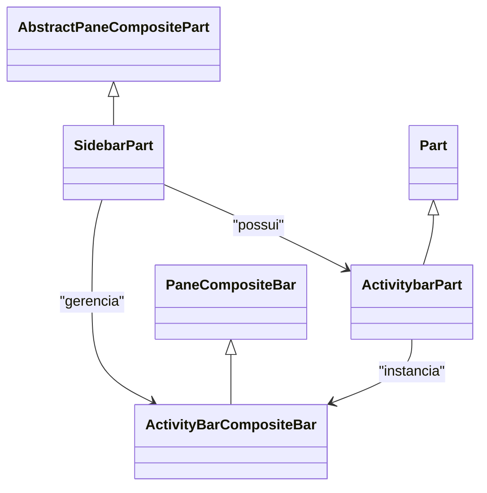

# 02C - Mapa de Código: Left Sidebar

## 1. Hierarquia de Classes

## 2. Arquivos Chave e Responsabilidades
- `vscode-main/src/vs/workbench/browser/parts/sidebar/sidebarPart.ts`:
    - Orquestrador da Sidebar. Gerencia a largura, cores e a instância da Activity Bar.
- `vscode-main/src/vs/workbench/browser/parts/activitybar/activitybarPart.ts`:
    - Implementa a lógica de renderização da barra de ícones e suporte à Modern UI.
- `vscode-main/src/vs/workbench/browser/parts/paneCompositePart.ts`:
    - Lógica genérica para partes compostas (estágios de visibilidade, pinagem).
- `vscode-main/src/vs/workbench/browser/layout.ts`:
    - Controla a posição global (Left/Right) e visibilidade da Sidebar.
- `vscode-main/src/vs/workbench/browser/parts/sidebar/visibleViewContainersTracker.ts`:
    - Rastreia quais containers de visualização estão ativos para gerenciar a auto-ocultação da Activity Bar.
- `vscode-main/src/vs/workbench/browser/parts/sidebar/sidebarPart.ts` (focus):
    - Implementa a lógica de navegação via teclado e movimentação de foco para a Activity Bar via `focusActivityBar()`.

## 3. Dependências de Serviços
- `IWorkbenchLayoutService`: Controla a visibilidade e posição dos componentes.
- `IViewsService`: Gerencia a criação e ativação de containers de visualização.
- `IConfigurationService`: Recupera configurações de usuário (ex: `ACTIVITY_BAR_LOCATION`).
- `IThemeService`: Resolve cores e tokens de tema para a UI.
